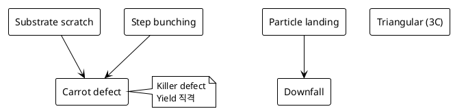

# 결함 유형 (BPD / TED / TSD / SF)

SiC 신뢰성은 **결정 결함**에 매우 민감합니다.
각 결함의 origin·검출 방법·소자 신뢰성 영향을 정리합니다.

## 1. 결함 분류 한눈에 보기

| 약어 | 풀네임 | 위치 | 검출 방법 | 신뢰성 영향 |
|------|--------|------|----------|------------|
| **BPD** | Basal Plane Dislocation | (0001) plane | PL, KOH | Bipolar degradation (가장 중요) |
| **TED** | Threading Edge Dislocation | c-축 따라 | KOH (소형 pit) | 누설↑ (경미) |
| **TSD** | Threading Screw Dislocation | c-축 따라 | KOH (대형 pit) | Gate oxide 누설 |
| **SF** | Stacking Fault | (0001) plane | PL (밝은 line) | BV 저하, drift |
| **Carrot** | Carrot defect | 표면 결함 | Optical | 치명적 |
| **Downfall** | Particle 낙하 결함 | 표면 | Optical | 치명적 |

## 2. BPD — Bipolar Degradation의 원흉

### 2.1 메커니즘

BPD는 substrate에 존재하는 **basal plane dislocation**.
Epi 성장 중 일부가 epi layer로 propagate 됩니다.

**Bipolar degradation**:
1. 전류 흐름 중 전자-정공 재결합 에너지가 결정 격자에 흡수
2. BPD가 **Shockley-type stacking fault (SSF)** 로 확장
3. SSF는 quantum well처럼 작동 → minority carrier 포획
4. → **Forward voltage drift, Ron 상승**

### 2.2 대응 전략

- **BPD → TED 변환**: epi 성장 시 step-flow 조건 최적화 → 90~99% 변환
- **Body diode stress test**: 출하 전 bipolar stress로 잠재 BPD 스크리닝

### 2.3 검출

- **PL imaging (UV excitation)**: BPD 자체보다 SSF가 밝은 라인으로 보임
- **X-ray topography**: 비파괴, 전 wafer

## 3. TSD / TED

| 항목 | TSD | TED |
|------|-----|-----|
| Burgers vector | c-axis 평행 | c-axis 수직 |
| KOH etch pit | 큰 hexagonal | 작은 hexagonal |
| 밀도 | ~10² cm⁻² | ~10³~10⁴ cm⁻² |
| 영향 | Gate oxide 누설, BV 저하 | 경미 |

## 4. Stacking Fault (SF)

- **Shockley SF**: bipolar stress로 BPD에서 확장 → 가역적이지 않음
- **In-grown SF**: epi 성장 중 발생 (3C inclusion 포함)

## 5. 표면 결함 (Carrot, Downfall, Triangular)

## 6. 검출 자동화 — Machine Vision

!!! experience "현장 노트"
    Si에서 WCMP 공정에 Machine Vision을 적용해 Best Practice 상을 받은 경험이 있습니다.
    SiC PL imaging에 유사 접근을 적용할 수 있습니다:

    1. **PL 이미지** 입력 (UV excitation 후 380nm·450nm·700nm 다중 채널)
    2. **U-Net / Mask R-CNN** 으로 결함 segmentation
    3. **결함 종류 분류**: BPD line / SSF / TED pit / Carrot / Triangular
    4. FDC와 연동: epi recipe parameter와 상관관계 분석

    상세 워크플로: [머신비전 적용 사례](../04-ai-applications/machine-vision.md)
    분류 모델: [불량 분류 모델](../04-ai-applications/defect-classification.md)

## 7. 신뢰성 시험 항목

| 시험 | 조건 | 검출 결함 |
|------|------|----------|
| HTGB | 175℃, V_GS_max | Gate oxide 결함 (TSD) |
| HTRB | 175℃, 0.8 × V_DS | Drift 결함 (Carrot, SF) |
| H3TRB | 85℃/85%RH, V_DS | Package + Carrot |
| Body diode stress | 100 A/cm², 100h | BPD → SSF |
| Surge current | Single pulse | Termination 결함 |

## 8. 참고 자료

- T. Kimoto, H. Tsuchida, *Defects in SiC: Origin and Reduction*
- JEDEC JESD22, JC-70 (SiC Reliability)
- Wolfspeed Reliability Reports
