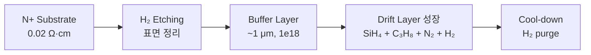
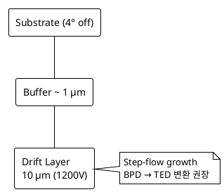

# Epitaxy 공정

SiC Power MOSFET의 **drift layer**를 형성하는 핵심 공정.
N+ 기판 위에 N⁻ epi layer를 **CVD 방식**으로 성장시킵니다.

## 1. 공정 개요

전구체:
- Si source: **Silane (SiH₄)** 또는 **TCS (SiHCl₃)**
- C source: **Propane (C₃H₈)** 또는 **Ethylene (C₂H₄)**
- N-type dopant: **N₂** (소량)
- Carrier gas: **H₂**

온도: **1500 ~ 1650 ℃**
압력: **수십 ~ 200 mbar**

## 2. 핵심 파라미터

### 2.1 C/Si ratio

성장 표면의 **C/Si 비율**이 결함 밀도·doping 효율을 결정합니다.

| C/Si | 특성 |
|------|------|
| < 1 (Si-rich) | Doping 효율↑, Stacking Fault 발생↑ |
| ~ 1 | 균형 |
| > 1 (C-rich) | 결함↓, but doping 효율↓ |

일반적으로 **0.9 ~ 1.2** 사이에서 최적화.

### 2.2 Off-axis Substrate (4° off)

4H-SiC 기판은 일반적으로 **(0001) Si-face에서 4° off-cut**.
- **장점**: Step-flow 성장 → polytype 안정성
- **단점**: BPD가 epi layer로 propagate (TED로 변환되도록 노력)

### 2.3 두께 / 농도 균일도

전 wafer 영역의 균일도 목표:
- 두께: **±3%** (Edge exclusion 5mm)
- 농도: **±10%**

## 3. 결함 종류 (성장 중 발생)

| 결함 | 원인 | 신뢰성 영향 |
|------|------|-----------|
| Carrot defect | Substrate scratch + step bunching | 누설전류↑, BV↓ |
| Triangular defect | 3C polytype inclusion | Catastrophic |
| Downfall | particle | Gate oxide 파괴 |
| BPD propagation | substrate BPD | Bipolar degradation |

→ 상세 내용은 [결함 유형](defects.md) 참조.

## 4. In-line / End-of-line 측정

### 4.1 In-line
- **두께**: FTIR 또는 reflectance spectroscopy
- **농도**: Hg-CV 또는 비접촉 C-V
- **표면**: Optical surface inspection (SICA88, Candela 등)

### 4.2 End-of-line
- **PL imaging**: BPD/SF 검출
- **KOH etch**: TED/TSD pit 검출 (sacrificial wafer)
- **X-ray topography**: substrate 단계 결함 확인

## 5. 측정 → FDC 연결 (응용)

!!! experience "현장 노트"
    Si Epi 공정에서 FDC를 운영한 경험상, SiC epi 챔버는 다음을 모니터링:

    - **MFC ratio** (SiH₄ / C₃H₈ / N₂ / H₂)
    - **Susceptor 온도** (pyrometer)
    - **Chamber 압력**
    - **Recipe step별 trace**

    AI 이상감지 적용 시 graph-based FDC (GNN) 가 적합:
    챔버 간 cross-correlation을 학습 → Tool 특이도 검출.

    상세: [FDC AI 이상 감지 적용 사례](../03-fdc-spc/ai-anomaly-detection.md)

## 6. 참고 자료

- T. Kimoto, "Bulk and epitaxial growth of silicon carbide", *Prog. Cryst. Growth Charact. Mater.*
- Aixtron / LPE Epi tool documentation
