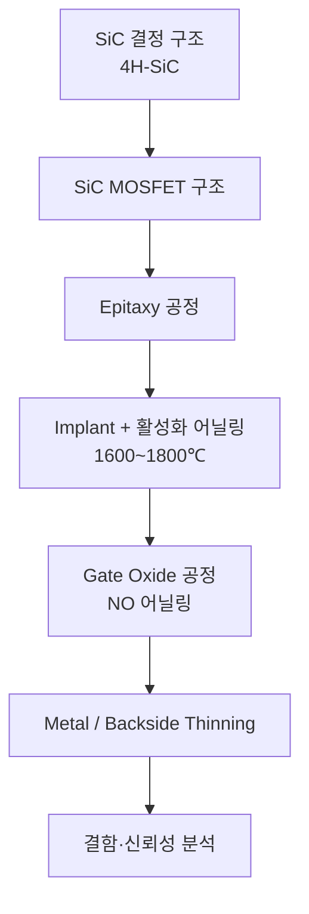

# 1. 소자·공정 개요

SiC(Silicon Carbide) 전력 소자의 구조·공정·결함을 정리한 섹션입니다.

## 학습 흐름

## 하위 문서

- [SiC MOSFET 구조](sic-mosfet-structure.md) — Planar vs Trench, JFET resistance, Pwell 설계
- [Epitaxy 공정](epitaxy.md) — CVD epitaxy, doping, drift layer 두께/농도 계산
- [결함 유형 (BPD/TED/TSD)](defects.md) — Basal Plane Dislocation, Threading Dislocation 등

## Si vs SiC 핵심 차이 요약

| 항목 | Si | SiC | 영향 |
|------|----|-----|------|
| Wafer 두께 | 700~775 μm | 350~500 μm | Backside thinning 필수 |
| Implant 활성화 | ~1000℃ | 1600~1800℃ | 고온 RTA, 캡 산화막 필요 |
| Gate Oxide | Dry/Wet O₂ | NO/N₂O 어닐링 | 계면 trap (Dit) 저감 핵심 |
| Etch | F계 dry etch | Cl₂/SF₆ 혼합 | 선택비 확보 어려움 |
| Defect | COP, OSF | BPD, TED, TSD, Carrots | Epi 결함이 신뢰성 직결 |
