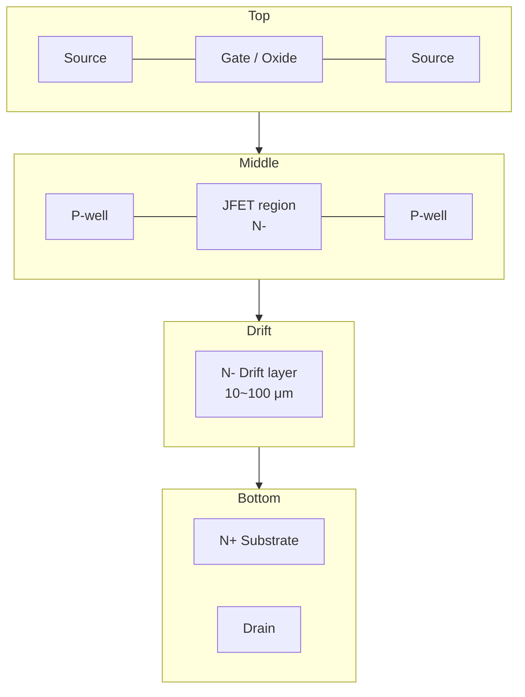

# SiC MOSFET 구조

## 1. 기본 구조

SiC Power MOSFET은 **수직형(Vertical) 구조**가 표준입니다.
드레인 전류가 표면 채널 → drift layer → backside drain으로 흐릅니다.

## 2. Planar vs Trench

| 항목 | Planar (DMOS) | Trench |
|------|---------------|--------|
| 채널 방향 | 수평 (basal plane) | 수직 (a-face 등) |
| 채널 이동도 | 낮음 (20~40 cm²/V·s) | 높음 (~100 cm²/V·s) |
| Cell pitch | 큼 | 작음 (집적도↑) |
| Ron 손실 | JFET resistance 큼 | JFET resistance 작음 |
| Gate oxide 신뢰성 | 안정 | Trench 코너 전계 집중 → 보호 구조 필요 |
| 대표 제품 | Wolfspeed, ROHM | Infineon CoolSiC™, ON Semi |

!!! experience "현장 노트"
    Trench 구조에서 가장 까다로운 부분은 **Trench 코너의 Gate oxide 신뢰성**입니다.
    Si Trench MOSFET 경험을 바탕으로 보면, SiC는 더 좁은 trench + 더 가파른 측벽 + NO 어닐링 조건 최적화가 핵심입니다.

## 3. 주요 설계 파라미터

### 3.1 Drift Layer 두께 / 농도

내압 $V_{BR}$ 와 drift layer 농도 $N_D$ 의 관계:

\[
V_{BR} \approx \frac{\varepsilon_s E_c^2}{2qN_D}
\]

\[
W_{drift} = \frac{\varepsilon_s E_c}{q N_D}
\]

여기서 $E_c \approx 2.5 \text{ MV/cm}$ (4H-SiC).

| 목표 내압 | $N_D$ (cm⁻³) | $W_{drift}$ (μm) |
|-----------|-------------|------------------|
| 650 V | ~1.5e16 | ~5 |
| 1200 V | ~8e15 | ~10 |
| 1700 V | ~5e15 | ~15 |
| 3300 V | ~2e15 | ~30 |

### 3.2 JFET Resistance

Planar 구조에서 JFET region의 폭과 doping이 Ron에 직접 영향:

\[
R_{JFET} \propto \frac{W_{JFET}}{q \mu_n N_D}
\]

너무 좁으면 JFET pinch-off로 Ron 증가, 너무 넓으면 cell pitch 증가.
일반적으로 **1.5~2.5 μm** 범위에서 최적화합니다.

### 3.3 P-well 농도 / 깊이

- P-well 농도 ↑ → threshold voltage ↑, BV 안정 / 채널 이동도 ↓
- P-well 깊이 ↓ → JFET resistance ↓ / punch-through 위험 ↑

## 4. 제조 공정 흐름 (요약)

```mermaid
flowchart LR
    A[Wafer 입고<br/>4H-SiC N+ + N- Epi] --> B[Alignment Mark]
    B --> C[P-well Implant<br/>Al]
    C --> D[N+ Source Implant<br/>P/N₂]
    D --> E[Activation Anneal<br/>1700℃, C-cap]
    E --> F[Gate Oxide + NO Anneal]
    F --> G[Poly Gate + Patterning]
    G --> H[Contact / ILD / Metal]
    H --> I[Backside Thinning]
    I --> J[Backside Metal + Laser Anneal]
    J --> K[Final Test]
```

## 5. 참고 자료

- B. J. Baliga, *Fundamentals of Power Semiconductor Devices*, Springer
- onsemi SiC MOSFET 제품군: <https://www.onsemi.com/products/discrete-power-modules/silicon-carbide-sic>
- T. Kimoto, *Fundamentals of Silicon Carbide Technology*, Wiley
