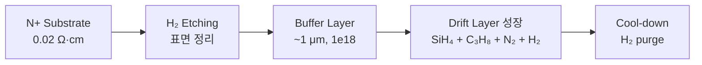
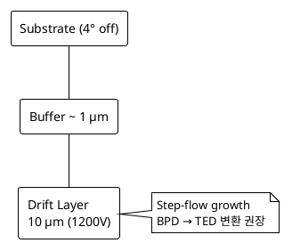

# Ch.2 SiC 웨이퍼 & 에피택셜 성장

> **핵심 키워드**: PVT · CMP · CVD epi · C/Si ratio · 4° off-cut · BPD→TED · Carrot / Triangular / Comet
> **목적**: 잉고트 성장 → Slicing → 에피택셜 성장까지 — 결함이 어디서 태어나는지 추적.

## 1. 잉고트 성장 (Crystal Growth)

- **PVT (Physical Vapor Transport)** — 현재 주류. SiC 분말을 2,300 ℃ 이상으로 승화 → Seed Crystal 위에 재증착.
- **HTCVD / Solution Growth** — 고품질 외 에피용. 대량 양산은 제한적.
- **핵심 결함 원인** — 적층 결함 (Stacking Fault), Micropipe, BPD / TSD / TED 결정 전위.

## 2. 웨이퍼 가공 (Slicing · Lapping · Polishing)

- SiC 는 Si 보다 단단하여 **Diamond Wire Saw** + **CMP** 사용 → 설비·소모품 비용 높음.
- 표면 상태 (Sub-surface damage) 가 이후 에피 결함 밀도를 좌우 → 웨이퍼 Vendor Qualification 이 결함 엔지니어링의 첫 단계.

## 3. 에피택셜 성장 (Drift Layer)

### 3.1 공정 개요

- Si source: **Silane (SiH₄)** 또는 **TCS (SiHCl₃)**
- C source: **Propane (C₃H₈)** 또는 **Ethylene (C₂H₄)**
- N-type dopant: **N₂** (소량)
- Carrier gas: **H₂**
- 온도: **1,500 ~ 1,650 ℃**, 압력: **수십 ~ 200 mbar**
- 두께 / 농도가 Breakdown Voltage 를 결정 — 1,200 V 급 ~10 μm, 1,700 V 급 ~15 μm 수준.
- **Multi-epi** — Super Junction · Drift · Buffer / Field-Stop 등 다층 구조.

### 3.2 C/Si Ratio

| C/Si | 특성 |
|------|------|
| < 1 (Si-rich) | Doping 효율↑, Stacking Fault 발생↑ |
| ≈ 1 | 균형 |
| > 1 (C-rich) | 결함↓, Doping 효율↓ |

일반적으로 **0.9 ~ 1.2** 사이에서 최적화.

### 3.3 Off-axis Substrate (4° off)

4H-SiC 기판은 일반적으로 **(0001) Si-face 에서 4° off-cut**:

- **장점** — Step-flow 성장 → polytype 안정성.
- **단점** — Substrate BPD 가 epi layer 로 propagate → **BPD→TED 전환** 을 유도하는 조건 최적화 필요.

### 3.4 두께 / 농도 균일도 목표

- 두께: **±3 %** (Edge exclusion 5 mm)
- 농도: **±10 %**

## 4. 에피 표면 결함 (AOI / ADC 검출 대상)

| 결함 모드 | 특징 | 영향 |
|---|---|---|
| **Carrot** | BPD + TSD 조합 결함, 당근 형태 | Killer (다이오드 Leakage) |
| **Triangular** | 3C polytype 도메인 삽입 | Killer / Slow-Killer |
| **Comet** | 입자 (Particle) 원인 결함 | Particle / Process 이슈 |
| **Step Bunching** | 표면 step 응집 | Gate Oxide 신뢰성 |
| **Pit / Pinhole** | 표면 함몰 결함 | Killer 가능 |
| **Downfall** | 챔버 입자 낙하 | Gate Oxide 파괴 |

→ 상세: [Part III §A-2 표면 결함](../03-defect/a02-surface.md) · [§A-3 Trench·Sub-CD](../03-defect/a03-trench-subcd.md) · [§B-5 AOI](../03-defect/b05-aoi.md) · [§B-6 ADC](../03-defect/b06-adc.md).

## 5. In-line / End-of-line 측정

### 5.1 In-line

- **두께** — FTIR 또는 Reflectance Spectroscopy
- **농도** — Hg-CV 또는 비접촉 C-V
- **표면** — Optical Surface Inspection (KLA Candela, SP3, SICA88 등)

### 5.2 End-of-line

- **PL Imaging** — BPD / SF 검출
- **KOH Etch** — TED / TSD pit 검출 (sacrificial wafer)
- **X-ray Topography** — Substrate 단계 결함 확인

## 6. 결함 대응 트렌드

- **BPD 수렴 기술** — 에피 성장 조건 최적화로 BPD→TED 전환. 재료 Vendor 가 99 % 이상 보장하는 흐름.
- **In-situ Cleaning / Pre-epi 조건** — Carrot 억제에 결정적.

## 7. 측정 → FDC 연결

!!! note "현장 관점"
    SiC 에피 챔버 FDC 운영 시 핵심 모니터링 항목:

    - **MFC ratio** (SiH₄ / C₃H₈ / N₂ / H₂)
    - **Susceptor 온도** (pyrometer)
    - **Chamber 압력**
    - **Recipe step 별 trace**

    AI 이상 감지 적용 시 **graph-based FDC (GNN)** 가 적합 — 챔버 간 cross-correlation 학습 → Tool 특이도 검출.

    참고: [FDC AI 이상 감지](../04-control-ai/fdc-ai-anomaly.md) · [GNN 기반 FDC](../04-control-ai/fdc-gnn.md).

## 8. 참고자료

- T. Kimoto, "Bulk and epitaxial growth of silicon carbide", *Prog. Cryst. Growth Charact. Mater.*
- Aixtron / LPE Epi tool documentation
- KEC SiC Epi Defect 관련 기술 자료
- Wolfspeed · Coherent (구 II-VI) Epi Spec 자료

---

## 추가 노트 (2026-05-24)

- Notion `Chapter 2. SiC 웨이퍼 & 에피택셜 성장` 본문과 기존 Epi 본문을 통합.
- §4 결함 표는 Notion 의 깨진 행을 재구성하고 누락된 Downfall 추가.
