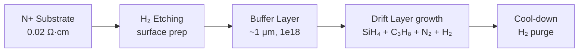
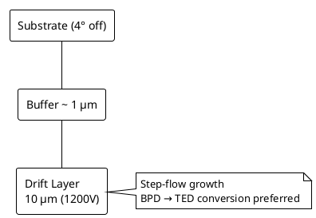

# Ch.2 SiC Wafer & Epitaxial Growth

> **Keywords**: PVT · CMP · CVD epi · C/Si ratio · 4° off-cut · BPD → TED · Carrot / Triangular / Comet
> **Purpose**: Track where defects are born — from ingot growth → slicing → epitaxial growth.

## 1. Ingot Growth (Crystal Growth)

- **PVT (Physical Vapor Transport)** — current mainstream. SiC powder is sublimed above 2,300 ℃ and re-deposited on the seed crystal.
- **HTCVD / Solution Growth** — for high-quality epi outside the bulk path. Mass production is limited.
- **Primary defect sources** — Stacking Faults, micropipes, BPD / TSD / TED dislocations.

## 2. Wafer Processing (Slicing · Lapping · Polishing)

- SiC is harder than Si, so **Diamond Wire Saw** + **CMP** are used → equipment and consumable cost is high.
- Sub-surface damage dictates downstream epi defect density → wafer **vendor qualification** is the first stage of defect engineering.

## 3. Epitaxial Growth (Drift Layer)

### 3.1 Process Overview

- Si source: **Silane (SiH₄)** or **TCS (SiHCl₃)**
- C source: **Propane (C₃H₈)** or **Ethylene (C₂H₄)**
- N-type dopant: **N₂** (trace)
- Carrier gas: **H₂**
- Temperature: **1,500 ~ 1,650 ℃**, Pressure: **tens ~ 200 mbar**
- Thickness / doping determines breakdown voltage — ~10 μm for 1,200 V class, ~15 μm for 1,700 V class.
- **Multi-epi** — multilayer stacks for Super Junction · Drift · Buffer / Field-Stop.

### 3.2 C/Si Ratio

| C/Si | Characteristic |
|------|------|
| < 1 (Si-rich) | Doping efficiency ↑, Stacking Fault occurrence ↑ |
| ≈ 1 | Balanced |
| > 1 (C-rich) | Fewer defects, doping efficiency ↓ |

Typically optimized in the **0.9 ~ 1.2** range.

### 3.3 Off-axis Substrate (4° off)

4H-SiC substrates are typically **4° off-cut from the (0001) Si-face**:

- **Pro** — Step-flow growth → polytype stability.
- **Con** — Substrate BPDs propagate into the epi layer → conditions must be optimized to favor the **BPD → TED conversion**.

### 3.4 Thickness / Doping Uniformity Targets

- Thickness: **±3 %** (Edge exclusion 5 mm)
- Doping: **±10 %**

## 4. Epi Surface Defects (AOI / ADC Detection Targets)

| Defect Mode | Characteristic | Impact |
|---|---|---|
| **Carrot** | BPD + TSD combined defect, carrot-shaped | Killer (diode leakage) |
| **Triangular** | 3C polytype domain insertion | Killer / Slow-Killer |
| **Comet** | Particle-induced defect | Particle / Process issue |
| **Step Bunching** | Surface step coalescence | Gate Oxide reliability |
| **Pit / Pinhole** | Surface depression | Potential killer |
| **Downfall** | Particle falling from the chamber | Gate Oxide breakdown |

→ Details: [Part III §A-2 Surface Defects](../03-defect/a02-surface.md) · [§A-3 Trench·Sub-CD](../03-defect/a03-trench-subcd.md) · [§B-5 AOI](../03-defect/b05-aoi.md) · [§B-6 ADC](../03-defect/b06-adc.md).

## 5. In-line / End-of-line Measurement

### 5.1 In-line

- **Thickness** — FTIR or Reflectance Spectroscopy
- **Doping** — Hg-CV or non-contact C-V
- **Surface** — Optical Surface Inspection (KLA Candela, SP3, SICA88, etc.)

### 5.2 End-of-line

- **PL Imaging** — BPD / SF detection
- **KOH Etch** — TED / TSD pit detection (sacrificial wafer)
- **X-ray Topography** — substrate-stage defect verification

## 6. Defect Response Trends

- **BPD convergence techniques** — Epi growth conditions optimized to convert BPD → TED. Material vendors increasingly guarantee 99 %+.
- **In-situ Cleaning / Pre-epi conditions** — decisive for suppressing carrot defects.

## 7. Measurement → FDC Linkage

!!! note "Field perspective"
    Key monitoring items for SiC epi-chamber FDC:

    - **MFC ratio** (SiH₄ / C₃H₈ / N₂ / H₂)
    - **Susceptor temperature** (pyrometer)
    - **Chamber pressure**
    - **Per-recipe-step traces**

    For AI anomaly detection, **graph-based FDC (GNN)** is well-suited — it learns cross-correlations between chambers and detects tool-specific anomalies.

    See: [FDC AI Anomaly Detection](../04-control-ai/fdc-ai-anomaly.md) · [GNN-based FDC](../04-control-ai/fdc-gnn.md).

## 8. References

- T. Kimoto, "Bulk and epitaxial growth of silicon carbide", *Prog. Cryst. Growth Charact. Mater.*
- Aixtron / LPE Epi tool documentation
- KEC SiC Epi Defect technical materials
- Wolfspeed · Coherent (formerly II-VI) Epi spec materials

---

## Notes (2026-05-24)

- Merged the Notion `Chapter 2. SiC Wafer & Epitaxial Growth` content with the existing Epi page.
- The §4 defect table was rebuilt from the broken Notion rows; the missing Downfall row was added.
