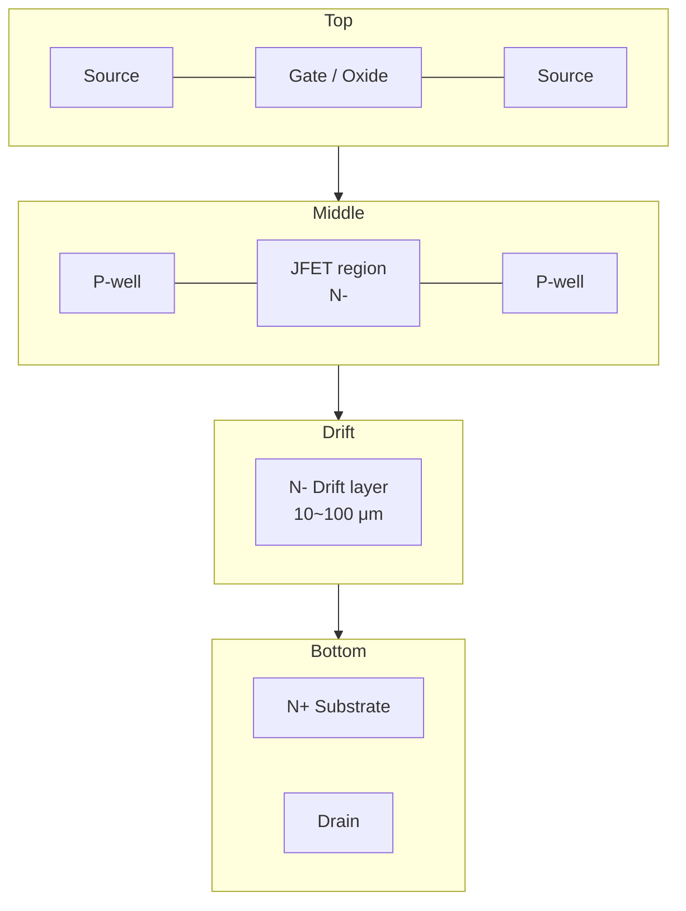

# Ch.3 SiC Device Structures

> **Keywords**: SBD/JBS · Planar DMOS · Trench UMOS · Super Junction · Vth · Bipolar Degradation · TDDB
> **Purpose**: Understand the operating principles and defect / reliability weak points of SiC SBD · MOSFET (Planar / Trench) · Super Junction.

## 1. SiC SBD (Schottky Barrier Diode)

- First SiC product to reach mass production. **Unipolar operation** → minimal reverse-recovery loss.
- **JBS (Junction Barrier Schottky)** — embedded P+ regions solve the surge-rating ↔ leakage trade-off.
- **Defect weak points** — Schottky leakage at TSD sites, killer impact of Carrot / Triangular defects.

## 2. SiC MOSFET — Basic Structure

The SiC Power MOSFET is standardized on a **vertical structure**. Drain current flows from the surface channel → drift layer → backside drain.

## 3. Planar (DMOS) vs Trench (UMOS)

| Item | Planar (DMOS) | Trench (UMOS) |
|------|---------------|---------------|
| Channel orientation | Horizontal (basal plane) | Vertical (a-face, etc.) |
| Channel mobility | Low (20~40 cm²/V·s) | High (~100 cm²/V·s) |
| Cell pitch | Large | Small (higher density) |
| Ron loss | Large JFET resistance | Small JFET resistance / dramatically reduced Ron |
| Gate Oxide reliability | Stable | Field crowding at trench corner → protection structure required |
| Defect-management focus | P-well channel · JFET pinch-region GOI | **In-trench defects** · corner GOI |
| Representative structures / products | Wolfspeed, ROHM (early) | Asymmetric Trench (Rohm) · Double-Trench (Toshiba) · Bottom P-shield (onsemi EliteSiC) |

!!! note "Key issue with trench structures"
    Gate-oxide reliability at the trench corner is the most demanding aspect. Narrow trench + steep sidewalls + **NO / N₂O annealing** condition optimization is the key. In-trench defects formed inside the trench are a core management item for mass-production sites.

## 4. SiC Super Junction

- Alternating N-pillars and P-pillars → achieve high voltage and low Ron simultaneously.
- **Process implementation** — multi-epi + ion implantation, or trench fill (P-pillar epi refill).
- **Defect weak points** — P-pillar alignment, bow / stress, ion-implant profile deviations.

## 5. Key Design Parameters

### 5.1 Drift-layer Thickness / Doping

Relation between breakdown voltage $V_{BR}$ and drift-layer doping $N_D$:

$$V_{BR} \approx \frac{\varepsilon_s E_c^2}{2qN_D}$$

$$W_{drift} = \frac{\varepsilon_s E_c}{q N_D}$$

with $E_c \approx 2.5 \text{ MV/cm}$ (4H-SiC).

| Target BV | $N_D$ (cm⁻³) | $W_{drift}$ (μm) |
|-----------|--------------|------------------|
| 650 V | ~1.5×10¹⁶ | ~5 |
| 1,200 V | ~8×10¹⁵ | ~10 |
| 1,700 V | ~5×10¹⁵ | ~15 |
| 3,300 V | ~2×10¹⁵ | ~30 |

### 5.2 JFET Resistance (Planar)

$$R_{JFET} \propto \frac{W_{JFET}}{q \mu_n N_D}$$

Too narrow causes JFET pinch-off and raises Ron; too wide increases cell pitch. Typically optimized in the **1.5 ~ 2.5 μm** range.

### 5.3 P-well Doping / Depth

- Higher P-well doping → higher threshold voltage and more stable BV, but lower channel mobility.
- Shallower P-well → lower JFET resistance, but increased punch-through risk.

## 6. Manufacturing Flow (summary)

Unit-process detail → [Ch.4 SiC Process Flow (FEOL → BEOL)](../02-process/ch04-process-flow.md).

## 7. Common Lifetime / Reliability Issues

| Issue | Mechanism | Related chapter |
|---|---|---|
| **Vth shift** | Trap-charge fluctuation at the SiC/SiO₂ interface under high-temperature, high-voltage stress | [D-13 BTI](../03-defect/d13-bti.md) |
| **Bipolar Degradation** | BPD-driven Stacking Fault expansion → Vf / Ron increase | [D-14 Body Diode & BPD](../03-defect/d14-body-diode.md) |
| **Gate Oxide TDDB** | Higher SiC/SiO₂ interface trap density than Si → narrower reliability margin | [D-12 Gate Oxide](../03-defect/d12-gate-oxide.md) |

## 8. References

- B. J. Baliga, *Fundamentals of Power Semiconductor Devices*, Springer
- T. Kimoto, *Fundamentals of Silicon Carbide Technology*, Wiley
- onsemi EliteSiC M3S Trench MOSFET Datasheet
- Toshiba, "Double-Trench SiC MOSFET", 2017
- Rohm Gen4 Trench Architecture White Paper
- [onsemi SiC MOSFET product line](https://www.onsemi.com/products/discrete-power-modules/silicon-carbide-sic)

---

## Notes (2026-05-24)

- Merged the Notion `Chapter 3. SiC Device Structures` content with the existing MOSFET page.
- Added new sections on SBD / JBS and Super Junction; added a defect-management column to the Planar / Trench comparison table.
