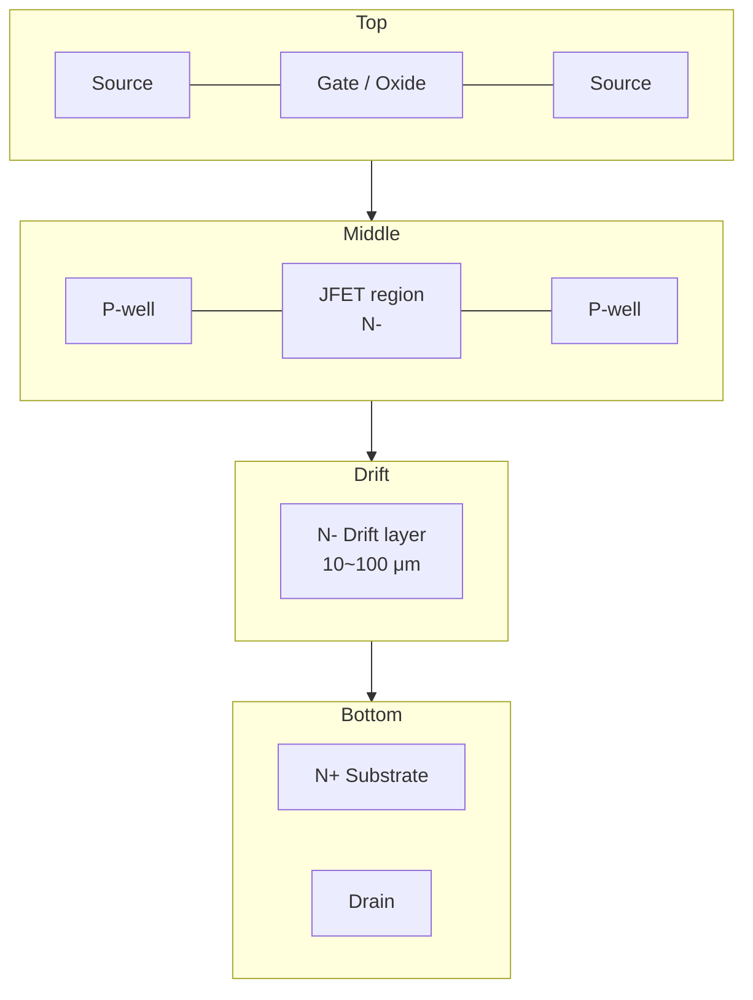

# Ch.3 SiC 디바이스 구조

> **핵심 키워드**: SBD/JBS · Planar DMOS · Trench UMOS · Super Junction · Vth · Bipolar Degradation · TDDB
> **목적**: SiC SBD · MOSFET (Planar / Trench) · Super Junction 의 동작 원리와 결함·신뢰성 취약점 파악.

## 1. SiC SBD (Schottky Barrier Diode)

- 가장 먼저 양산된 SiC 제품. **단극성 동작** → 역회복 손실 극소.
- **JBS (Junction Barrier Schottky)** — P+ 영역 임베딩으로 Surge 내량 · Leakage 트레이드오프 해결.
- **결함 취약** — TSD 위치의 Schottky Leakage, Carrot / Triangular 의 Killer 영향.

## 2. SiC MOSFET 기본 구조

SiC Power MOSFET 은 **수직 (Vertical) 구조** 가 표준. 드레인 전류가 표면 채널 → drift layer → backside drain 으로 흐름.

## 3. Planar (DMOS) vs Trench (UMOS)

| 항목 | Planar (DMOS) | Trench (UMOS) |
|------|---------------|---------------|
| 채널 방향 | 수평 (basal plane) | 수직 (a-face 등) |
| 채널 이동도 | 낮음 (20~40 cm²/V·s) | 높음 (~100 cm²/V·s) |
| Cell pitch | 큼 | 작음 (집적도↑) |
| Ron 손실 | JFET resistance 큼 | JFET resistance 작음 / Ron 획기적 감소 |
| Gate Oxide 신뢰성 | 안정 | Trench 코너 전계 집중 → 보호 구조 필요 |
| 결함 관리 포인트 | P-well 채널 · JFET pinch 영역 GOI | **In-trench defect** · 코너 GOI |
| 대표 구조·제품 | Wolfspeed, ROHM (초기) | Asymmetric Trench (Rohm) · Double-Trench (Toshiba) · Bottom P-shield (onsemi EliteSiC) |

!!! note "Trench 구조 핵심 이슈"
    Trench 코너의 Gate Oxide 신뢰성이 가장 까다로움. 좁은 trench + 가파른 측벽 + **NO / N₂O 어닐링** 조건 최적화가 핵심. Trench 내부에서 발생하는 In-trench defect 는 양산 사이트의 핵심 관리 항목.

## 4. SiC Super Junction

- N-pillar 와 P-pillar 를 교차 배치 → 고전압 · 저 Ron 동시 달성.
- **공정 구현** — 다중 에피 + 이온주입 (Multi-epi) 또는 Trench fill (P-pillar epi refill).
- **결함 취약** — P-pillar 정렬, Bow / Stress, 이온주입 프로파일 이상.

## 5. 주요 설계 파라미터

### 5.1 Drift Layer 두께 / 농도

내압 $V_{BR}$ 와 drift layer 농도 $N_D$ 의 관계:

$$V_{BR} \approx \frac{\varepsilon_s E_c^2}{2qN_D}$$

$$W_{drift} = \frac{\varepsilon_s E_c}{q N_D}$$

여기서 $E_c \approx 2.5 \text{ MV/cm}$ (4H-SiC).

| 목표 내압 | $N_D$ (cm⁻³) | $W_{drift}$ (μm) |
|-----------|--------------|------------------|
| 650 V | ~1.5×10¹⁶ | ~5 |
| 1,200 V | ~8×10¹⁵ | ~10 |
| 1,700 V | ~5×10¹⁵ | ~15 |
| 3,300 V | ~2×10¹⁵ | ~30 |

### 5.2 JFET Resistance (Planar)

$$R_{JFET} \propto \frac{W_{JFET}}{q \mu_n N_D}$$

너무 좁으면 JFET pinch-off 로 Ron 증가, 너무 넓으면 cell pitch 증가. 일반적으로 **1.5 ~ 2.5 μm** 범위에서 최적화.

### 5.3 P-well 농도 / 깊이

- P-well 농도 ↑ → Threshold voltage ↑, BV 안정 / 채널 이동도 ↓
- P-well 깊이 ↓ → JFET resistance ↓ / Punch-through 위험 ↑

## 6. 제조 공정 흐름 (요약)

```mermaid
flowchart LR
    A[Wafer 입고<br/>4H-SiC N+ + N- Epi] --> B[Alignment Mark]
    B --> C[P-well Implant<br/>Al]
    C --> D[N+ Source Implant<br/>P/N₂]
    D --> E[Activation Anneal<br/>1700℃, C-cap]
    E --> F[Gate Oxide + NO Anneal]
    F --> G[Poly Gate + Patterning]
    G --> H[Contact / ILD / Metal]
    H --> I[Backside Thinning]
    I --> J[Backside Metal + Laser Anneal]
    J --> K[Final Test]
```

상세 단위 공정 → [Ch.4 SiC 공정 흐름 (FEOL→BEOL)](../02-process/ch04-process-flow.md).

## 7. 공통 수명·신뢰성 이슈

| 이슈 | 메커니즘 | 관련 챕터 |
|---|---|---|
| **Vth Shift** | 고온·고전압 stress 시 SiC/SiO₂ 계면 trap charge 변동 | [D-13 BTI](../03-defect/d13-bti.md) |
| **Bipolar Degradation** | BPD 기인 Stacking Fault 확장 → Vf / Ron 증가 | [D-14 Body Diode & BPD](../03-defect/d14-body-diode.md) |
| **Gate Oxide TDDB** | SiC/SiO₂ 계면 trap 밀도가 Si 대비 높아 신뢰성 마진 낮음 | [D-12 Gate Oxide](../03-defect/d12-gate-oxide.md) |

## 8. 참고자료

- B. J. Baliga, *Fundamentals of Power Semiconductor Devices*, Springer
- T. Kimoto, *Fundamentals of Silicon Carbide Technology*, Wiley
- onsemi EliteSiC M3S Trench MOSFET Datasheet
- Toshiba, "Double-Trench SiC MOSFET", 2017
- Rohm Gen4 Trench Architecture White Paper
- [onsemi SiC MOSFET 제품군](https://www.onsemi.com/products/discrete-power-modules/silicon-carbide-sic)

---

## 추가 노트 (2026-05-24)

- Notion `Chapter 3. SiC 디바이스 구조` 본문과 기존 MOSFET 본문을 통합.
- SBD / JBS · Super Junction 섹션 신설, Planar / Trench 비교표에 결함 관리 포인트 컬럼 추가.
