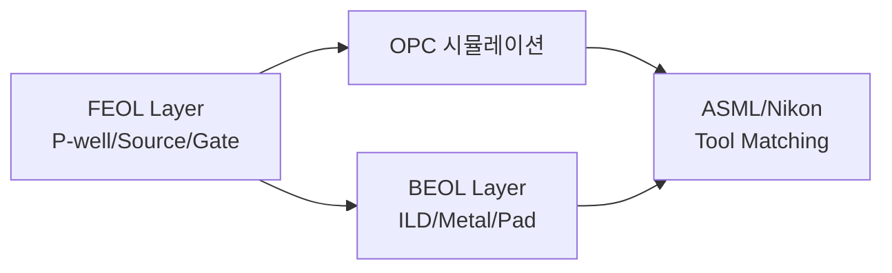

# 2. Photo 공정 개요

24년간 Photo 공정 엔지니어로 쌓은 경험을 SiC 컨텍스트로 재정리합니다.
SiC는 Si 8인치 fab의 Photo 인프라(KrF, i-line)를 거의 그대로 활용 가능하지만, **wafer warpage / backside cleanness / overlay** 측면에서 별도 고려가 필요합니다.

## 학습 흐름

## 하위 문서

- [FEOL/BEOL 포토리소그래피](feol-beol.md) — Layer별 노광 조건, 정렬, 두께 관리
- [OPC 마스크 설계](opc-mask.md) — Optical Proximity Correction, OPC 시뮬레이션
- [ASML/Nikon Tool Matching](tool-matching.md) — Tool 간 dose/focus/overlay matching 방법론

## SiC Photo의 특이사항

| 이슈 | 원인 | 대응 |
|------|------|------|
| Wafer warpage | Bow ±50 μm 수준 | Vacuum chuck 강화, Backside grind 후 stress relief |
| Backside contamination | Hot implant 후 SiC 입자 | Backside scan + cleaning |
| Alignment mark 손상 | 1700℃ 활성화 anneal | Carbon cap 보호 또는 heat-resistant mark |
| Photoresist 박리 | 고온 implant 공정 부담 | Hard mask (SiO₂, Si₃N₄) 활용 |

!!! experience "현장 노트"
    Si에서 BEOL MTL Layer Alignment / Overlay 안정화로 사내 논문상을 받았습니다(2006).
    SiC에서도 동일한 통계 기반 접근(R, Python)으로 Overlay 시그마를 잡을 수 있습니다.
    상세: [Tool Matching](tool-matching.md)
