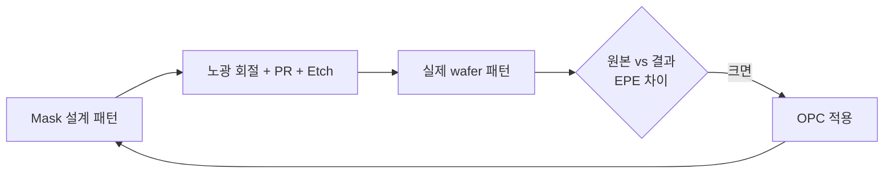
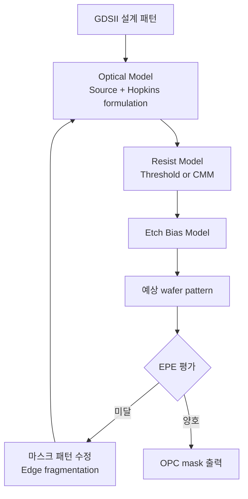

# OPC 마스크 설계

OPC(Optical Proximity Correction)는 **노광 회절** 및 **공정 변형**을 보정하기 위해 마스크 패턴을 미리 왜곡시키는 기술입니다.

## 1. 왜 OPC가 필요한가

해상도 한계 $k_1 \approx 0.4$ 영역에서는:
- **Line-end shortening**: 직선 끝이 짧아짐
- **Corner rounding**: 사각형 모서리가 둥글어짐
- **Iso-dense bias**: 고립 패턴 vs 밀집 패턴이 다른 CD

→ 마스크에 **Hammer-head, Serif, Assist feature, Sub-resolution Assist Feature (SRAF)** 추가

## 2. OPC 방식 분류

| 종류 | 설명 | 적용 |
|------|------|------|
| **Rule-based OPC** | 사전 정의된 룰로 보정 | 단순 layer, 빠른 turn-around |
| **Model-based OPC** | Optical + Process model로 시뮬레이션 후 보정 | 중요 layer, 고정밀 |
| **Inverse Lithography (ILT)** | 원하는 결과에서 역산 → 자유 형상 mask | 가장 정확, 계산 비용 큼 |

## 3. OPC 시뮬레이션 흐름

핵심 모델:
- **Optical model**: Source shape, NA, σ → kernel decomposition
- **Resist model**: CMM (Compact Modeling), VTRE (Variable Threshold)
- **Etch model**: dense/iso bias 보정

## 4. EPE (Edge Placement Error)

\[
EPE = (CD_{target} - CD_{simulated}) / 2 \pm \text{edge shift}
\]

평가 지점: contour 상의 수십~수백 evaluation point.

목표: **EPE 3σ < CD × 10%**

## 5. SiC에 OPC를 어떻게 적용할까

!!! experience "현장 노트"
    Si Logic / LDI / BCD에서 OPC mask 설계와 photo mask optimization 시뮬레이션을 수행한 경험이 있습니다.
    SiC도 동일 KrF 노광기 기반이므로 OPC 적용은 즉시 가능합니다.

    **다만 SiC 특이점**:

    1. **Hard mask + PR stack** 노광 → 단일 PR보다 effective threshold가 다름. Resist model 별도 calibration 필요.
    2. **Wafer warpage** → focus 변화 폭이 큼. **Focus-Exposure Matrix (FEM)** 가 더 넓게 흩어짐 → OPC model에 focus tolerance 반영.
    3. **Trench MOSFET의 trench top corner** → 곡률 보정용 hammer-head 적용으로 corner CD 안정화.

## 6. 검증 → 양산 흐름

## 7. 관련 특허 (저자)

- **Method for Recipe Generation of CD-SEM Equipment** (출원 10-2009-0134508 / 공개 10-2011-0077841)
- **Method for Preventing Wafer Edge Defocus of Exposure Equipment** (등록 10-0917821, 2009.09)

## 8. 참고 자료

- A. Wong, *Resolution Enhancement Techniques in Optical Lithography*, SPIE
- Synopsys Proteus / Mentor Calibre Application Notes
- SPIE Photomask Technology Proceedings
