# Ch.4 SiC Process Flow (FEOL → BEOL)

> **Keywords**: Hot Implant · Activation Anneal · Carbon Cap · Trench Etch · Gate Oxide NO Anneal · Laser Anneal · BEOL
> **Purpose**: Why SiC processing is special vs. Si, and at which steps defects are typically introduced.

## 1. End-to-end Map (typical Trench MOSFET)

1. **Epitaxial growth** (drift / buffer)
2. **P-well / N+ Source Implant** (High-T 500–1,000 ℃)
3. **JTE / Field Limiting Ring Implant**
4. **Activation Annealing** (1,600–1,800 ℃, Carbon Cap)
5. **Trench Etch** (depth control, bottom-corner rounding)
6. **Sacrificial Oxidation + Strip**
7. **Gate Oxide** (Dry O₂ + NO / N₂O Anneal)
8. **Poly-Si Gate Deposition / CMP**
9. **Inter-Layer Dielectric / Contact Etch**
10. **Source Metallization** (Ni / Al)
11. **Backside Grinding** (~100 μm)
12. **Backside Implant + Laser Annealing**
13. **Backside Metal** (drain)
14. **Passivation**

```mermaid
flowchart LR
    A[Epi] --> B[Hot Implant]
    B --> C[JTE/FLR]
    C --> D[Activation<br/>+ C-Cap]
    D --> E[Trench Etch]
    E --> F[Sac. Ox]
    F --> G[Gate Ox<br/>+ NO Anneal]
    G --> H[Poly Gate]
    H --> I[ILD / Contact]
    I --> J[Source Metal]
    J --> K[Backside Grind]
    K --> L[Backside Laser Anneal]
    L --> M[Backside Metal]
    M --> N[Passivation]
```

## 2. SiC-specific Issues

| Process | SiC specificity | Defect risk |
|---|---|---|
| **Implant** | **Hot Implant** above 500 ℃ (Si is RT) | Channeling, profile deviation |
| **Activation Anneal** | ≥ 1,600 ℃, **Carbon Cap required** | Step bunching, cap residue |
| **Trench Etch** | SF₆ / O₂-based ICP (no Bosch process) | In-trench micro-defects, sidewall roughness |
| **Gate Oxidation** | NO / N₂O post-anneal required (reduce Dit) | Interface traps, Vth shift, TDDB |
| **Backside** | **Laser Anneal** (avoid front-side thermal damage) | Ohmic contact peel-off, wafer warp |

## 3. Critical Steps for Defect Control

| Step | Inspection / Control | Linked chapter |
|---|---|---|
| **Epi** | 100 % inspection of surface / Carrot / Triangular defects (KLA Candela / SP3) | [A-2 Surface](../03-defect/a02-surface.md) · [B-5 AOI](../03-defect/b05-aoi.md) |
| **Trench Etch** | Sub-CD micro defects — electron-microscope AOI · TEM cross-section | [A-3 Trench·Sub-CD](../03-defect/a03-trench-subcd.md) |
| **Gate Oxide** | Initial BV / TDDB electrical tests, in production SPC management | [C-8 SPC](../03-defect/c08-spc.md) · [D-12 Gate Oxide](../03-defect/d12-gate-oxide.md) |
| **Backside** | Particle / crack — Backside AOI · VOG | [C-9 VOG](../03-defect/c09-vog.md) |

## 4. Industry View (BK Factory)

- onsemi BK Factory is reported as an **Epi-to-Package integrated SiC Trench MOSFET / SBD mass-production line**.
- Therefore **in-trench · sub-CD micro · surface defect** management is the central area for process stabilization, yield, and reliability.
- For the general flow of defect baseline setting and SPC settling when introducing a new process, see [C-10 New Process Introduction](../03-defect/c10-new-process.md).

## 5. References

- T. Kimoto · J. A. Cooper, *Fundamentals of Silicon Carbide Technology*, Wiley
- onsemi EliteSiC manufacturing-process conference presentations
- ECS / ICSCRM Proceedings — SiC FEOL · BEOL sessions

---

## Notes (2026-05-24)

- First migration of Notion `Chapter 4. SiC Process Flow (FEOL → BEOL)`.
- Rebuilt broken table rows; added a new critical-step cross-link table to Part III.
