# Ch.4 SiC 공정 흐름 (FEOL→BEOL)

> **핵심 키워드**: Hot Implant · Activation Anneal · Carbon Cap · Trench Etch · Gate Oxide NO Anneal · Laser Anneal · BEOL
> **목적**: SiC 공정이 Si 대비 특별한 이유와, 결함이 주로 어떤 단계에서 도입되는지 정리.

## 1. 전체 공정 맵 (Typical Trench MOSFET)

1. **에피택셜 성장** (Drift / Buffer)
2. **P-well / N+ Source Implant** (High-T 500–1,000 ℃)
3. **JTE / Field Limiting Ring Implant**
4. **Activation Annealing** (1,600–1,800 ℃, Carbon Cap)
5. **Trench Etch** (Depth 관리, Bottom Corner Rounding)
6. **Sacrificial Oxidation + Strip**
7. **Gate Oxide** (Dry O₂ + NO / N₂O Anneal)
8. **Poly-Si Gate Deposition / CMP**
9. **Inter-Layer Dielectric / Contact Etch**
10. **Source Metallization** (Ni / Al)
11. **Backside Grinding** (~100 μm)
12. **Backside Implant + Laser Annealing**
13. **Backside Metal** (Drain)
14. **Passivation**

```mermaid
flowchart LR
    A[Epi] --> B[Hot Implant]
    B --> C[JTE/FLR]
    C --> D[Activation<br/>+ C-Cap]
    D --> E[Trench Etch]
    E --> F[Sac. Ox]
    F --> G[Gate Ox<br/>+ NO Anneal]
    G --> H[Poly Gate]
    H --> I[ILD / Contact]
    I --> J[Source Metal]
    J --> K[Backside Grind]
    K --> L[Backside Laser Anneal]
    L --> M[Backside Metal]
    M --> N[Passivation]
```

## 2. SiC 특유 이슈

| 공정 | SiC 특수성 | 결함 위험 |
|---|---|---|
| **Implant** | 500 ℃ 이상 **Hot Implant** (Si 는 RT) | Channeling, 프로파일 편차 |
| **Activation Anneal** | 1,600 ℃ 이상, **Carbon Cap 필수** | Step bunching, Cap 잔류물 |
| **Trench Etch** | SF₆ / O₂ 계열 ICP (Bosch 미사용) | In-trench micro-defect, sidewall roughness |
| **Gate Oxidation** | NO / N₂O post-anneal 필수 (Dit 감소) | 계면 trap, Vth shift, TDDB |
| **Backside** | **Laser Anneal** (front-side 열손상 방지) | Ohmic Contact 박리, Wafer warp |

## 3. 결함 제어의 Critical Step

| 단계 | 검사 / 관리 방법 | 연결 챕터 |
|---|---|---|
| **Epi** | 표면 · Carrot · Triangular 결함 100 % 검사 (KLA Candela / SP3) | [A-2 표면 결함](../03-defect/a02-surface.md) · [B-5 AOI](../03-defect/b05-aoi.md) |
| **Trench Etch** | Sub-CD micro-defect — 전자현미경 AOI · TEM cross-section | [A-3 Trench·Sub-CD](../03-defect/a03-trench-subcd.md) |
| **Gate Oxide** | 초기 BV · TDDB 전기적 시험, 양산 SPC 관리 | [C-8 SPC](../03-defect/c08-spc.md) · [D-12 Gate Oxide](../03-defect/d12-gate-oxide.md) |
| **Backside** | 파티클 / Crack — Backside AOI · VOG | [C-9 VOG](../03-defect/c09-vog.md) |

## 4. 산업 적용 관점 (BK Factory)

- onsemi BK Factory 는 **Epi-to-Package 일관 SiC Trench MOSFET / SBD 양산 라인** 으로 알려져 있음.
- 따라서 **In-trench · Sub-CD micro · 표면 결함** 관리가 공정 안정화·수율·신뢰성 확보의 중점 영역.
- 신규 공정 도입 시 결함 베이스라인 설정과 SPC 안착의 일반 흐름은 [C-10 신규 공정 도입시 결함 관리](../03-defect/c10-new-process.md) 참조.

## 5. 참고자료

- T. Kimoto · J. A. Cooper, *Fundamentals of Silicon Carbide Technology*, Wiley
- onsemi EliteSiC 제조 프로세스 컨퍼런스 발표자료
- ECS / ICSCRM Proceedings — SiC FEOL · BEOL session

---

## 추가 노트 (2026-05-24)

- Notion `Chapter 4. SiC 공정 흐름 (FEOL→BEOL)` 본문 1차 이관.
- 깨진 표 행 재구성 + Part III cross-link 표 신설.
