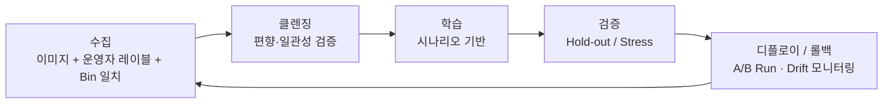

# B-6 ADC (Auto Defect Classification)

> **핵심 키워드**: Killer Recall · Underkill / Overkill · Unknown Rate · Auto-rate · Scenario-based Retraining · Drift Monitoring
> **목적**: AI 기반 결함 분류 시스템의 **운영 · 재학습 · 관리 체계** 표준화.

## 1. ADC 의 역할

- AOI 가 찾은 결함 후보를 **클래스별로 자동 분류** → Killer / Slow-Killer / Nuisance 구분 ([A-1 분류 체계 참조](a01-classification.md)).
- 운영자 Bias 제거, Underkill / Overkill 관리, Yield 조기 원인 추적.
- 핵심 출력: **Defect Class · Confidence · (필요 시) Bounding Box / Mask**.

## 2. 주요 KPI (9)

| KPI | 정의 | 목표 |
|---|---|---|
| **Accuracy** | 전체 정답률 | ≥ 95 % |
| **Recall (Killer)** | Killer 탐지율 | ≥ 99 % |
| **Precision** | 예측 Killer 중 실제 Killer 비율 | ≥ 90 % |
| **Underkill** | Killer 를 Pass 로 오분류 | ≤ 0.1 % |
| **Overkill** | Pass 를 Killer 로 오분류 | 관리 임계 |
| **Unknown Rate** | 분류 불가 | ≤ 5 % |
| **NG Rate** | 이미지 품질 불량 | ≤ 1 % |
| **Auto-rate** | 자동 처리 비율 | ≥ 90 % |
| **Manual Review** | 수동 검증 | Recall · Drift 모니터링 |

## 3. 재학습 사이클 (Retraining Loop)

## 4. 시나리오 기반 학습관리

자유 실험 대신 **Production-aware Scenario** 로 묶어 재현성 확보:

- "장비 PM 이후 Drift 보정 재학습"
- "레시피 변경 후 재학습"
- "주기적 공정 변화 대응 재학습"

데이터 · 코드 · 파라미터 · 결과를 **'제3자 재현 가능성' 수준** 으로 관리.

## 5. 운영 포인트

- ADC 는 모델 정확도만이 아니라 **Killer Recall · Underkill · Overkill · Unknown Rate · Manual Review Load** 를 함께 관리해야 함.
- 재학습 트리거: 장비 PM, Recipe 변경, 신규 결함 클래스 등장, Yield Excursion 등 **생산 이벤트** 와 연결.
- 모델 배포 전후로 **Hold-out / Recent Production / Stress Set** 을 분리하여 성능 저하·Drift 검증.

→ 출력 다운스트림: [B-7 Klarity](b07-klarity.md) (Defect DB + Yield Cross-tab) · [C-8 SPC](c08-spc.md) (Defect Density Trend) · [A-4 Killer RCA](a04-killer-rca.md) (만성 결함 종결).

연결 (AI 응용): [Machine Vision 적용](../04-control-ai/ai-machine-vision.md) · [불량 분류 모델](../04-control-ai/ai-defect-classification.md).

## 6. 참고자료

- KLA — *AI-driven ADC* White Paper
- onsemi BK Factory ADC / Klarity 운영 관련 공개 자료

---

## 추가 노트 (2026-05-24)

- Notion `D-Ch.6 ADC (Auto Defect Classification)` 본문 1차 이관 + 재학습 사이클 mermaid 추가.
