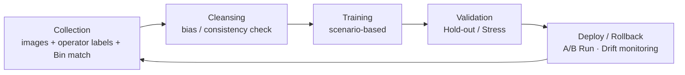

# B-6 ADC (Auto Defect Classification)

> **Keywords**: Killer Recall · Underkill / Overkill · Unknown Rate · Auto-rate · Scenario-based Retraining · Drift Monitoring
> **Purpose**: Standardize the **operation · re-learning · management** of AI-based defect classification.

## 1. Role of ADC

- Auto-classify the defect candidates found by AOI **into classes** → distinguish Killer / Slow-Killer / Nuisance ([see A-1 Classification](a01-classification.md)).
- Removes operator bias, manages Underkill / Overkill, accelerates yield-root-cause tracking.
- Key outputs: **Defect Class · Confidence · (optionally) Bounding Box / Mask**.

## 2. Main KPIs (9)

| KPI | Definition | Target |
|---|---|---|
| **Accuracy** | Overall correctness | ≥ 95 % |
| **Recall (Killer)** | Killer-detection rate | ≥ 99 % |
| **Precision** | Of predicted killers, share that are truly killers | ≥ 90 % |
| **Underkill** | Killer misclassified as Pass | ≤ 0.1 % |
| **Overkill** | Pass misclassified as Killer | manage to threshold |
| **Unknown Rate** | Unclassifiable | ≤ 5 % |
| **NG Rate** | Image-quality failure | ≤ 1 % |
| **Auto-rate** | Share of automated handling | ≥ 90 % |
| **Manual Review** | Manual verification load | monitor Recall · Drift |

## 3. Re-learning Cycle

## 4. Scenario-based Learning Management

Instead of free-form experiments, bundle work into **Production-aware Scenarios** for reproducibility:

- "Re-learning for drift correction after equipment PM"
- "Re-learning after a recipe change"
- "Periodic re-learning to absorb process drift"

Manage data · code · parameters · results to the **"third-party reproducibility" standard**.

## 5. Operational Notes

- ADC must be managed by **Killer Recall · Underkill · Overkill · Unknown Rate · Manual Review Load**, not accuracy alone.
- Re-learning triggers: equipment PM, recipe change, emergence of a new defect class, yield excursion — tie to **production events**.
- Around model deployment, separate **Hold-out / Recent Production / Stress sets** to verify regression and drift.

→ Downstream: [B-7 Klarity](b07-klarity.md) (defect DB + yield cross-tab) · [C-8 SPC](c08-spc.md) (defect-density trends) · [A-4 Killer RCA](a04-killer-rca.md) (closing chronic defects).

AI-application links: [Machine Vision application](../04-control-ai/ai-machine-vision.md) · [Defect Classification Model](../04-control-ai/ai-defect-classification.md).

## 6. References

- KLA — *AI-driven ADC* White Paper
- Public materials on onsemi BK Factory ADC / Klarity operations

---

## Notes (2026-05-24)

- First migration of Notion `D-Ch.6 ADC (Auto Defect Classification)` + added a re-learning cycle mermaid.
