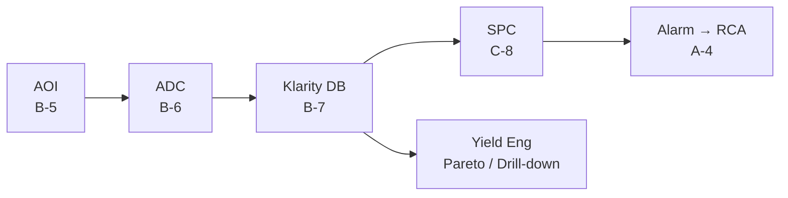

# B-7 Klarity Operations

> **Keywords**: KLA Klarity · Defect Source Analysis (DSA) · Wafer Map Pattern Recognition · Defect-to-Yield Correlation · Daily Drill-down
> **Purpose**: Use KLA Klarity Defect / Yield Engineering Tool in SiC production — Wafer Map pattern analysis, defect DB, yield-to-defect connection.

## 1. Klarity Core Features

| Feature | Description |
|---|---|
| **Defect Source Analysis (DSA)** | Identify equipment / time / lot origins |
| **Wafer Map Pattern Recognition** | Auto-classify Edge / Center / Scratch / Cluster patterns |
| **Defect-to-Yield Correlation** | Defect-class × Yield Bin cross-tab |
| **Trend / Pareto / Drill-down** | SPC · FDC integration |

## 2. SiC-specific Operating Points

| Scenario | Klarity usage |
|---|---|
| **Track BPD → Stacking Fault conversion** | Combine PL imaging + Klarity to monitor across time ([see D-14](d14-body-diode.md)) |
| **Carrot · Triangular spatial pattern** | Reactor-source correlation analysis ([see A-2](a02-surface.md)) |
| **Sub-CD micro-defect clustering** | Demonstrate the effect of etch-recipe changes ([see A-3](a03-trench-subcd.md)) |

## 3. ADC ↔ Klarity Integration

- [B-6 ADC](b06-adc.md) output → loaded into the Klarity DB → Yield Engineer reviews **Pareto · Trend · Map per defect class** in a single view.
- Prioritize ADC re-learning by **yield-loss impact**.

## 4. Daily Operating Rhythm

- **Daily / Weekly** — defect-density trend review.
- **On yield excursion** — single-pivot query: Top-3 defect classes, map patterns, recent tool changes.

## 5. Operational Notes

- The heart of Klarity is **connecting defect class · wafer-map pattern · tool history · yield bin in a single screen**.
- On yield excursions, maintain the standard drill-down: **Top defect class → spatial pattern → recent tool / recipe change**.

## 6. References

- KLA Klarity Defect / Yield User Manual
- KLA Tencor White Paper — *Yield Acceleration with Klarity Defect*

---

## Notes (2026-05-24)

- First migration of Notion `D-Ch.7 Klarity Operations` + added an AOI → ADC → Klarity → SPC pipeline mermaid.
