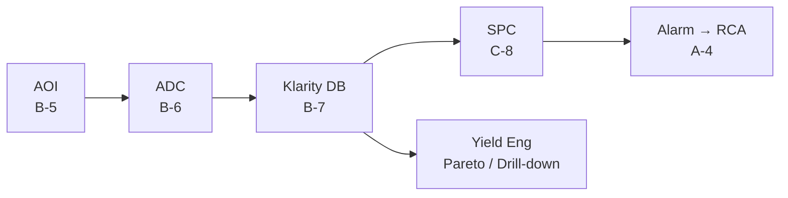

# B-7 Klarity 운영

> **핵심 키워드**: KLA Klarity · Defect Source Analysis (DSA) · Wafer Map Pattern Recognition · Defect-to-Yield Correlation · Daily Drill-down
> **목적**: KLA Klarity Defect / Yield Engineering Tool 을 SiC 양산에서 활용 — Wafer Map 패턴 분석, Defect DB, Yield-to-Defect 연결.

## 1. Klarity 핵심 기능

| 기능 | 설명 |
|---|---|
| **Defect Source Analysis (DSA)** | 장비 / 시점 / Lot 원인 식별 |
| **Wafer Map Pattern Recognition** | Edge / Center / Scratch / Cluster 패턴 자동 분류 |
| **Defect-to-Yield Correlation** | Defect 클래스 × Yield Bin Cross-tab |
| **Trend / Pareto / Drill-down** | SPC · FDC 연동 |

## 2. SiC 특화 운영 포인트

| 운영 시나리오 | Klarity 활용 |
|---|---|
| **BPD → Stacking Fault 전환 추적** | PL 이미지 + Klarity 결합으로 시간 축 모니터링 ([D-14 참조](d14-body-diode.md)) |
| **Carrot · Triangular 공간 패턴** | Reactor Source 연관 분석 ([A-2 참조](a02-surface.md)) |
| **Sub-CD micro-defect 클러스터링** | Etch 레시피 변경 효과 증명 ([A-3 참조](a03-trench-subcd.md)) |

## 3. ADC ↔ Klarity 연결

- [B-6 ADC](b06-adc.md) 출력 → Klarity DB 적재 → Yield Engineer 가 **Defect Class 단위 Pareto · Trend · Map** 을 한 화면에서 조회.
- ADC 재학습 필요성을 **Yield Loss 관점** 으로 우선순위화.

## 4. 일상 운영 흐름

- **Daily / Weekly** — Defect Density Trend Review.
- **Yield Excursion 발생 시** — 1포인트 조회: Top-3 Defect Class, Map 패턴, Recent Tool 변경 이력.

## 5. 운영 포인트

- Klarity 운영의 핵심은 **Defect Class · Wafer Map Pattern · Tool History · Yield Bin 을 한 화면에서 연결** 하는 것.
- Yield Excursion 시 **Top Defect Class → Spatial Pattern → Recent Tool / Recipe Change** 의 표준 Drill-down 흐름 유지.

## 6. 참고자료

- KLA Klarity Defect / Yield User Manual
- KLA Tencor White Paper — *Yield Acceleration with Klarity Defect*

---

## 추가 노트 (2026-05-24)

- Notion `D-Ch.7 Klarity 운영` 본문 1차 이관 + AOI→ADC→Klarity→SPC mermaid 추가.
