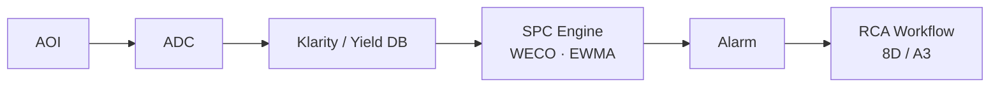

# C-8 SPC 기반 결함 밀도 관리

> **핵심 키워드**: WECO Rule · Cpk / Ppk · Defect Density (D0) · Yield Model · EQC · Statistical FDC · PCA · Hotelling T²
> **목적**: 양산에서 **결함 밀도 · 수율 · 신뢰성** 을 SPC 로 관리하는 체계 정립.

## 1. SPC 기본

| 차트 | 용도 |
|---|---|
| Run Chart, X-bar, R | 평균 / 산포 |
| p, np, c, u | 불량률 / 결함 수 |
| EWMA, CUSUM | 작은 shift 조기 검출 |

- **WECO Rule** — 1~8번 규칙. 양산 Drift · Trend 조기 경보.
- **Cpk / Ppk** — 공정 능력. SiC 양산에서는 1.33 · 1.67 을 도메인별로 다르게 적용.

→ Weco Rule 의 실전 설계 사례: [Photo Weco Rule 설계](../04-control-ai/fdc-weco-rules.md).

## 2. Defect Density (D0) 관리

- Layer 별 Defect Density Trend (Run / Lot / Wafer 단위).
- **Yield Model** — Murphy / Negative Binomial:

$$Y = e^{-A \cdot D_0} \quad \text{또는} \quad Y = \left(1 + \frac{A \cdot D_0}{\alpha}\right)^{-\alpha}$$

- Killer 클래스만 필터링한 **Killer Defect Density** 별도 관리 ([A-1 분류 체계 참조](a01-classification.md)).

## 3. EQC · PM Chart · FDC · Statistical FDC

| 시스템 | 역할 |
|---|---|
| **EQC** (Equipment Quality Control) | 장비 단위 SPC |
| **PM Chart** | PM 주기·효과 관리 |
| **FDC** (Fault Detection and Classification) | 실시간 센서 이상 탐지 |
| **Statistical FDC** | 다변량 시계열 분석 — PCA, Hotelling T² 기반 이상 탐지 |

→ FDC AI 확장: [FDC AI 이상 감지](../04-control-ai/fdc-ai-anomaly.md) · [GNN 기반 FDC](../04-control-ai/fdc-gnn.md).

## 4. 시스템 아키텍처

## 5. 운영 포인트

- Defect Density SPC 는 **Layer · Tool · Recipe · Lot · Wafer 단위로 분해** 해 관리해야 원인 추적 가능.
- WECO Rule 은 False Alarm 을 최소화하면서도 Excursion 을 조기 감지하도록 **공정별 튜닝**.
- **Tool-to-Tool Matching** — 평균뿐 아니라 분산 · Tail · Spatial Signature 까지 함께 비교.

## 6. 참고자료

- D. C. Montgomery, *Introduction to Statistical Quality Control*, Wiley
- AEC Q002 / Q003 (Automotive Defect Density)

---

## 추가 노트 (2026-05-24)

- Notion `D-Ch.8 SPC 기반 결함 밀도 관리` 본문 1차 이관 + Yield Model 수식·시스템 아키텍처 mermaid 추가.
