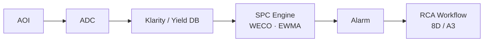

# C-8 SPC-based Defect Density Management

> **Keywords**: WECO Rule · Cpk / Ppk · Defect Density (D0) · Yield Model · EQC · Statistical FDC · PCA · Hotelling T²
> **Purpose**: Establish a system to manage **defect density · yield · reliability** with SPC in mass production.

## 1. SPC Basics

| Chart | Use |
|---|---|
| Run Chart, X-bar, R | Mean / dispersion |
| p, np, c, u | Defect rate / count |
| EWMA, CUSUM | Early detection of small shifts |

- **WECO Rule** — rules 1–8. Early warning for production drift and trend.
- **Cpk / Ppk** — process capability. SiC mass production applies 1.33 · 1.67 differently per domain.

→ Real-world WECO rule design: [Photo WECO Rule Design](../04-control-ai/fdc-weco-rules.md).

## 2. Defect Density (D0) Management

- Per-layer Defect Density Trend (Run / Lot / Wafer basis).
- **Yield Model** — Murphy / Negative Binomial:

$$Y = e^{-A \cdot D_0} \quad \text{or} \quad Y = \left(1 + \frac{A \cdot D_0}{\alpha}\right)^{-\alpha}$$

- Maintain a separate **Killer Defect Density** filtered to killer classes only ([see A-1 Classification](a01-classification.md)).

## 3. EQC · PM Chart · FDC · Statistical FDC

| System | Role |
|---|---|
| **EQC** (Equipment Quality Control) | Per-equipment SPC |
| **PM Chart** | PM cycle and effectiveness management |
| **FDC** (Fault Detection and Classification) | Real-time sensor-based anomaly detection |
| **Statistical FDC** | Multivariate time-series analysis — anomaly detection by PCA, Hotelling T² |

→ FDC AI extension: [FDC AI Anomaly Detection](../04-control-ai/fdc-ai-anomaly.md) · [GNN-based FDC](../04-control-ai/fdc-gnn.md).

## 4. System Architecture

## 5. Operational Notes

- Defect-density SPC must be **decomposed by Layer · Tool · Recipe · Lot · Wafer** to enable root-cause tracing.
- Tune WECO Rules **per process** to minimize false alarms while catching excursions early.
- **Tool-to-Tool Matching** — compare mean, variance, tail, and spatial signature together (not just the mean).

## 6. References

- D. C. Montgomery, *Introduction to Statistical Quality Control*, Wiley
- AEC Q002 / Q003 (Automotive Defect Density)

---

## Notes (2026-05-24)

- First migration of Notion `D-Ch.8 SPC-based Defect Density Management` + added yield-model equations and system-architecture mermaid.
