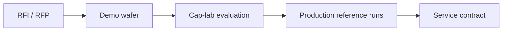

# C-10 Defect Management for New Process Introduction

> **Keywords**: PFMEA · RPN · Detection Coverage · Equipment Qualification · Ramp-up Risk Mgmt · ADC initial training set
> **Purpose**: Manage defect risk **proactively** when introducing a new process or device.

## 1. Four-Stage Structure

| Stage | Activity |
|---|---|
| 1. **Predict** | Predict latent defect modes — per-layer · per-unit-process PFMEA |
| 2. **Define** | Define the inspection system — secure Detection per defect mode. Equipment · recipe · test combinations |
| 3. **Select** | Equipment selection · vendor collaboration — sensitivity · area · throughput · operating economics · vendor roadmap |
| 4. **Transfer** | Transfer to production — SPC limits · recipe lock · ADC initial training set |

## 2. PFMEA Example (Trench MOSFET)

| Process | Latent defect | S | O | D | RPN | Action |
|---|---|---|---|---|---|---|
| **Trench Etch** | Sidewall Roughness | 9 | 5 | 4 | **180** | SEM cross-section, AOI rule |
| **Gate Oxidation** | Pinhole / Thinning | 10 | 3 | 5 | **150** | BV monitor, NO post-anneal |
| **Implant** | Profile shift | 8 | 3 | 3 | 72 | SIMS QA, Cpk management |

> S=Severity, O=Occurrence, D=Detection, RPN=S·O·D. For more on latent defects see [A-1 Defect Classification](a01-classification.md) · [A-3 Trench·Sub-CD](a03-trench-subcd.md).

## 3. Inspection-System Definition — Checklist

- Stages: wafer incoming · epi · Photo · Etch · Implant · Anneal · Gate · BEOL · Backside · Final.
- For each stage, secure **Killer · Slow-Killer defect coverage**.
- Compute the **inspection TPT ↔ yield-loss trade-off**.

## 4. Equipment Selection · Vendor Protocol

- KLA · Lasertec · AMAT · Hitachi-High-Tech · TASMIT — SiC-dedicated equipment bid competition.

## 5. Production Transfer (Ramp-up Risk Management)

| Period | Activity |
|---|---|
| **First month** | Observe Defect Density ↔ Bin-Yield mismatch → re-learn ADC |
| **Months 2–3** | Lock SPC Limit, set EVT cadence, finalize VOG Sample Plan |

## 6. Operational Notes

- New-process introduction must close in the order **PFMEA → inspection coverage → equipment / recipe verification → SPC / ADC lock**.
- Early in ramp-up monitor not only yield but **defect-class drift · unknown rate · tool matching · VOG escape risk** together.

## 7. References

- AIAG-VDA FMEA Handbook
- SEMI Equipment Qualification Guideline (E10 / E14 / E58)

---

## Notes (2026-05-24)

- First migration of Notion `D-Ch.10 Defect Management for New Process Introduction` + added an equipment-selection mermaid.
