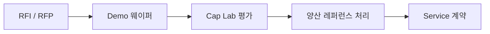

# C-10 신규 공정 도입시 결함 관리

> **핵심 키워드**: PFMEA · RPN · Detection Coverage · Equipment Qualification · Ramp-up Risk Mgmt · ADC 초기 교육
> **목적**: 신규 공정 / 디바이스 도입 시 결함 리스크를 **선제적으로** 관리.

## 1. 4단계 구조

| 단계 | 활동 |
|---|---|
| 1. **Predict** | 잠재 결함 모드 예측 — 계층 · 단위 공정별 PFMEA |
| 2. **Define** | 검사 체계 정의 — 결함 모드별 Detection 확보. 장비 · 레시피 · 테스트 조합 |
| 3. **Select** | 장비 선정 · 벤더 협업 — 감도 · 면적 · 처리속도 · 운영 경제성 · Vendor Roadmap 검토 |
| 4. **Transfer** | 양산 이관 — SPC 관리 한계 · Recipe Lock · ADC 초기 교육 세트 |

## 2. PFMEA 적용 예시 (Trench MOSFET)

| 공정 | 잠재 결함 | S | O | D | RPN | Action |
|---|---|---|---|---|---|---|
| **Trench Etch** | Sidewall Roughness | 9 | 5 | 4 | **180** | SEM cross-section, AOI rule |
| **Gate Oxidation** | Pinhole / Thinning | 10 | 3 | 5 | **150** | BV monitor, NO post-anneal |
| **Implant** | Profile shift | 8 | 3 | 3 | 72 | SIMS QA, Cpk 관리 |

> S=Severity, O=Occurrence, D=Detection, RPN=S·O·D. 자세한 잠재 결함은 [A-1 결함 분류 체계](a01-classification.md) · [A-3 Trench·Sub-CD](a03-trench-subcd.md) 참조.

## 3. 검사 체계 정의 체크리스트

- 단계: 웨이퍼 입고 · 에피 · Photo · Etch · Implant · Anneal · Gate · BEOL · Backside · Final.
- 각 단계별 **Killer · Slow-Killer Defect 커버리지** 확보 여부.
- **검사 TPT ↔ Yield Loss Trade-off** 계산.

## 4. 장비 선정 · 벤더 협업 프로토콜

- KLA · Lasertec · AMAT · Hitachi-High-Tech · TASMIT 등 SiC 전용 장비 견적 경쟁.

## 5. 양산 이관 (Ramp-up Risk Mgmt)

| 기간 | 활동 |
|---|---|
| **초기 1개월** | Defect Density ↔ Bin Yield Mismatch 관찰 → ADC 재학습 |
| **2~3개월** | SPC Limit 고정, EVT 주기 설정, VOG Sample Plan 확정 |

## 6. 운영 포인트

- 신규 공정 도입은 **PFMEA → 검사 커버리지 정의 → 장비 / 레시피 검증 → SPC / ADC Lock** 순서로 닫아야 함.
- Ramp-up 초기에는 Yield 뿐 아니라 **Defect Class Drift · Unknown Rate · Tool Matching · VOG Escape 가능성** 을 함께 모니터링.

## 7. 참고자료

- AIAG-VDA FMEA Handbook
- SEMI Equipment Qualification Guideline (E10 / E14 / E58)

---

## 추가 노트 (2026-05-24)

- Notion `D-Ch.10 신규 공정 도입시 결함 관리` 본문 1차 이관 + 장비 선정 mermaid 추가.
