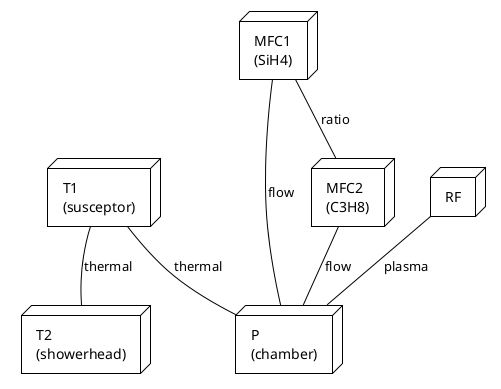
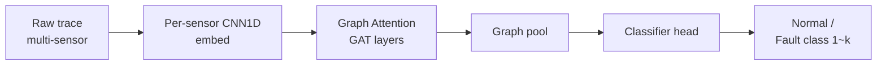
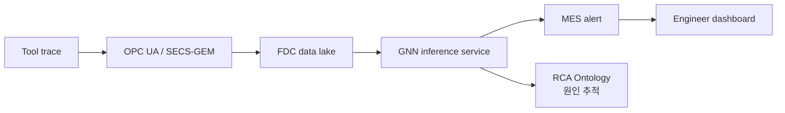

# FDC AI 이상 감지 적용 사례

저자가 DB HiTek Fab Innovation Team에서 수행한 **Graph Deep Neural Network 기반 FDC 이상 감지** 적용 사례 정리.
관련 논문: *"Graph Deep Neural Network-based Fault Detection and Classification in Semiconductor Manufacturing"* (KCS 2023)

## 1. 배경 / 문제 정의

기존 FDC:
- Univariate SPC 기반 → trace의 풍부한 정보 활용 어려움
- Recipe step별 mean/min/max 같은 summary feature만 사용
- 챔버 간 cross-correlation 미반영

## 2. GNN 접근

장비를 **그래프**로 모델링:

- **Node**: 챔버 내 센서 (온도, 압력, MFC, RF, ...)
- **Edge**: 센서 간 물리적/공정적 상관관계
- **Node feature**: 시계열 trace embedding (CNN/LSTM)
- **Graph feature**: 챔버 전체 signature

## 3. 모델 구조

핵심:
- **Per-sensor embedding**: 각 trace를 fixed-length vector로 인코딩
- **Graph Attention**: 센서 간 중요도를 학습으로 결정
- **Multi-task**: anomaly detection + 원인 클래스 분류 동시

## 4. 학습 데이터

| 데이터 | 출처 | 규모 |
|--------|------|------|
| Normal | 사내 FDC log (1년) | ~50,000 runs |
| Known fault | RCA case 기반 라벨링 | ~3,000 runs |
| Synthetic fault | physics-based injection | ~5,000 runs |

라벨링은 PM(Preventive Maintenance) 로그와 결합해 자동화.

## 5. 결과 (DB HiTek 사례 기반)

| Metric | Univariate SPC | GNN FDC |
|--------|----------------|---------|
| Detection latency | run+1 | real-time |
| Recall (known fault) | 0.68 | 0.93 |
| Precision | 0.55 | 0.86 |
| Engineer 분석 시간 | 30~60 min/case | ~5 min |

## 6. SiC 공정에 적용 시 고려사항

!!! experience "현장 노트"
    SiC 신규 공정 (epi, 1700℃ anneal, NO 어닐링) 은 **정상 데이터 자체가 부족**.
    Si fab의 GNN FDC 패턴을 그대로 transfer 하려면 다음이 필요합니다.

    1. **Domain adaptation**: Si fab pre-train → SiC fab fine-tune
    2. **One-class / contrastive learning**: 정상만으로 학습하는 접근
    3. **Physics-informed**: epi의 mass balance / energy balance 제약을 loss에 포함

## 7. 시스템 통합 흐름

- RCA Ontology와 연결되면 "어떤 sensor가 어떤 결함을 유발했는가" 까지 자동 추정 가능
- PCB Root Cause Analysis ontology 설계 경험 (저자 현 INTERX 업무)을 SiC fab에 응용 가능

## 8. 참고 자료

- 저자 논문: *Graph Deep Neural Network-based Fault Detection and Classification in Semiconductor Manufacturing*, KCS 2023
- Velickovic et al., *Graph Attention Networks*, ICLR 2018
- Aibiz FDC AI 협업 사례 (사내)
- SECS/GEM standards (SEMI)
