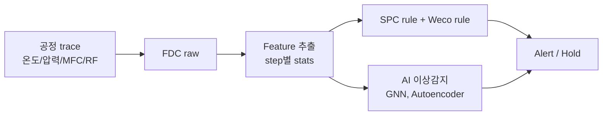

# 3. FDC / SPC 개요

**FDC (Fault Detection & Classification)** 와 **SPC (Statistical Process Control)** 는
공정 변동을 실시간(또는 lot 단위)으로 감지하고 조치하는 핵심 인프라입니다.

저자는 DB HiTek Fab Innovation Team에서 FDC AI 이상감지(Aibiz 공동), FDC/SPC Weco 설계 및 고도화를 담당했습니다.

## 학습 흐름

## 하위 문서

- [Weco Rule 설계](weco-rules.md) — Western Electric rule + 사내 확장 룰 설계
- [FDC AI 이상 감지 적용 사례](ai-anomaly-detection.md) — GNN 기반 FDC 사례 (KCS2023 논문 기반)

## FDC vs SPC 차이

| 항목 | FDC | SPC |
|------|-----|-----|
| 데이터 | Trace (시계열, 초~수십 Hz) | Summary (1 lot당 1점) |
| 주기 | Run-by-run (또는 실시간) | Lot-by-lot |
| 목적 | 장비 이상 검출 | 공정 산포 관리 |
| 출력 | Tool down / hold | 공정 alert |
| AI 적합도 | 매우 높음 (대용량 trace) | 보통 |

## SiC에서 FDC가 중요한 이유

1. **고가 wafer**: SiC 8인치 wafer는 Si의 ~10배 단가. 한 lot 손실 = 큰 손해
2. **공정 변동이 결함에 직결**: epi 챔버 mass flow 미세 차이 → carrot defect ↑
3. **새 공정 도입**: 1700℃ activation anneal 등 신규 공정의 안정화에 FDC 필수

→ **공정 trace → 결함 → 신뢰성** 의 인과 사슬을 데이터로 추적
