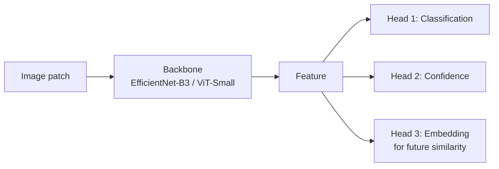
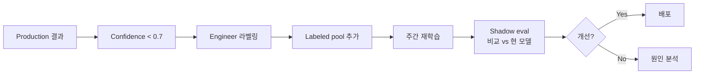
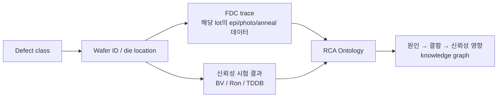

# 불량 분류 모델

SiC wafer / die 단위 결함을 분류하는 모델 설계 노트.

## 1. 문제 정의 매트릭스

| Granularity | 입력 | 클래스 수 | 모델 후보 |
|-------------|------|----------|----------|
| Wafer map | W×H bin map | 5~10 (radial/ring/edge/scratch/...) | CNN, ViT |
| Die patch | 256×256 image | 10~30 | EfficientNet, Swin |
| Pixel mask | full image | per-pixel multiclass | U-Net++, SegFormer |
| Time-series | trace | 2 (normal/fault) | LSTM, Transformer |

## 2. 추천 모델 흐름



**Multi-head 추천 이유**:
1. Classification head — 표준 라벨 예측
2. Confidence head — uncertainty estimation, 인간 검토 라우팅
3. Embedding head — 신규 결함 발견 시 유사 사례 검색

## 3. 학습 전략

### 3.1 데이터 부족 환경

SiC 신규 공정은 라벨 데이터 부족 → 다음 조합:

- **Self-supervised pre-training**: SimCLR, DINOv2로 unlabeled wafer image 활용
- **Few-shot fine-tune**: 라벨 100~1000개로 미세 조정
- **Class balancing**: focal loss + weighted sampling

### 3.2 Continual Learning

신규 결함이 발견될 때마다 재학습:



### 3.3 Out-of-distribution Detection

미지의 결함이 들어왔을 때 강건하게 대응:

- **Mahalanobis distance** on feature space
- **Energy-based OOD**: free energy 계산
- Confidence가 낮으면 **"Unknown" 클래스로 분리** → engineer 검토 강제

## 4. 평가 (양산용)

| 지표 | 정의 | 목표 |
|------|------|------|
| Macro F1 | 클래스 평균 F1 | > 0.85 |
| Worst-class recall | 가장 약한 클래스 | > 0.7 |
| FAR @ 95% recall | False Alarm Rate | < 5% |
| OOD AUROC | OOD vs ID | > 0.9 |
| Engineer agreement | 사람과 일치율 | > 0.9 |

## 5. 모델 카드 (배포 시 작성)

배포 모델마다 다음 문서를 동봉:

```
- 모델 이름 / 버전 / 학습일
- 학습 데이터: 출처 / 규모 / 라벨링 방법
- 평가 데이터: train과 분리된 holdout 명세
- 성능: per-class metric + worst-case
- 제약 사항: 어떤 wafer/공정 조건에서 검증되지 않음
- 알려진 실패 사례: 어떤 결함을 잘못 분류하는지
- 책임자 / 연락처
```

## 6. RCA Ontology 연계

결함 분류 결과를 **공정 trace + 신뢰성 결과** 와 연결:



→ 저자의 PCB Root Cause Analysis ontology 설계 경험(INTERX 현 업무)을 SiC 도메인으로 그대로 확장.

## 7. 참고 자료

- Tan & Le, *EfficientNet*, ICML 2019
- Liu et al., *Swin Transformer*, ICCV 2021
- Hendrycks & Gimpel, *Baseline for Detecting Misclassified and OOD Examples*, ICLR 2017
- 저자 사례: WCMP MV 분류 모델 운영 (DB HiTek)
