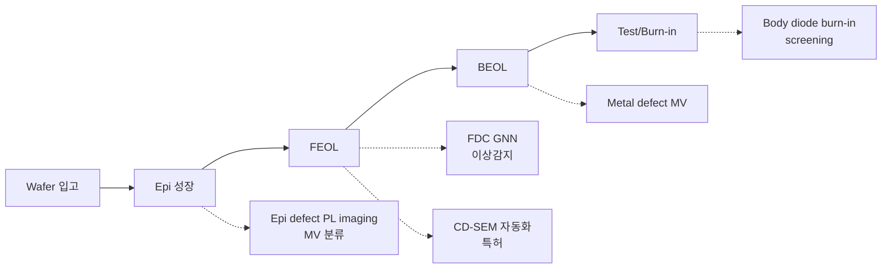

# 4. AI 적용 개요

SiC 반도체 제조에서 AI가 가치를 만들 수 있는 영역을 정리합니다.
저자의 머신비전 / FDC AI / 분류 모델 경험을 SiC 도메인으로 매핑합니다.

## AI 가치 영역 매핑

## 하위 문서

- [머신비전 적용 사례](machine-vision.md) — PL imaging / Optical inspection / Defect segmentation
- [불량 분류 모델](defect-classification.md) — CNN / Vision Transformer 기반 분류

## 본인 적용 경험 (Si fab)

| 사례 | 기술 | 결과 |
|------|------|------|
| WCMP 공정 Machine Vision | CNN + classical CV | Best Practice 수상 |
| FDC GNN 이상감지 | Graph Attention Net | KCS2023 논문 |
| OPC simulation | Optical + resist + etch model | 마스크 최적화 특허 |
| CD-SEM Recipe 자동화 | Image processing + auto-recipe | 특허 10-2009-0134508 |
| Tool Matching | R/Python 통계 분석 | BEOL Overlay 안정화 (논문상) |

## SiC AI 적용 시 차별화 포인트

1. **데이터 희소성**: 신규 공정 → labeled data 부족 → semi-supervised / synthetic data 필요
2. **물리 기반 결합**: SiC physics (Shockley-Read-Hall, dislocation dynamics) 와 결합 → Physics-Informed Neural Network
3. **온톨로지 기반 RCA**: 결함 ↔ 공정 trace ↔ 신뢰성 시험 결과를 ontology로 연결
4. **장시간 신뢰성 예측**: bipolar degradation, gate oxide TDDB → time-series survival model
