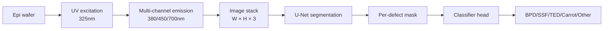
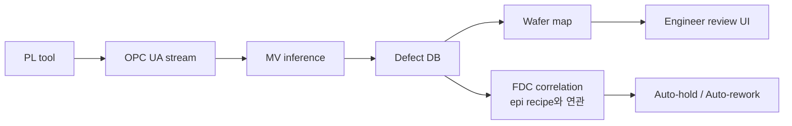

# 머신비전 적용 사례

SiC fab에서 Machine Vision이 가치를 만들 수 있는 영역과 구현 패턴 정리.
저자의 Si WCMP MV (Best Practice 수상) 경험을 SiC로 확장합니다.

## 1. 적용 영역

| 영역 | 입력 이미지 | 검출 대상 | 모델 후보 |
|------|-----------|----------|-----------|
| Epi 결함 검출 | PL image (UV) | BPD/SSF/TED/Carrot | U-Net, Mask R-CNN |
| Wafer 표면 검사 | Bright/Dark field | Particle, scratch | YOLO, CNN |
| Pattern inspection | SEM | CD outlier, bridging | Anomaly detection |
| Backside scan | Optical | 입자 contamination | Classical CV + CNN |
| Die-level test | Microscope | Crack, chipping | EfficientNet |

## 2. PL Imaging 기반 Epi 결함 검출 (가장 유망)

### 2.1 데이터 흐름

### 2.2 U-Net 학습 팁

- Loss: **Dice + Focal** 조합 — 작은 결함(TED pit)에 가중
- Augmentation: rotation, flip만 (intensity는 보존 — PL intensity가 의미)
- Class imbalance: heavy oversampling for Carrot/Triangular

### 2.3 인퍼런스 시간

- 8인치 wafer 1장: ~50~100 patches (5×5 mm)
- GPU(T4) 기준 1 wafer < 5초 → 양산 적용 가능

## 3. 시스템 통합

- MV 결과를 **FDC trace 와 join** → 어떤 recipe 변수가 carrot defect를 유발했는지 추적
- RCA Ontology에 통합 → "epi MFC C/Si > 1.2 + susceptor T > X → triangular defect ↑" 같은 규칙 자동 추출

## 4. 저자 적용 사례 (Si → SiC 시사점)

!!! experience "WCMP 공정 Machine Vision 적용 경험"
    Si WCMP(Tungsten CMP) 후 wafer에 발생하는 **dishing / erosion / scratch** 패턴을
    Optical inspection + CNN 으로 분류하여 자동 disposition을 적용한 사례.
    (DB HiTek Best Practice 상)

    **핵심 성공 요인**:

    1. **현장 정의가 우선**: 결함 정의를 엔지니어와 1주일 워크숍으로 명확화. 라벨 합의 후 모델링 시작.
    2. **간단한 모델로 출발**: ResNet18 + classical CV feature 결합으로 baseline 확보 → 이후 모델 고도화.
    3. **데이터셋 운영체계**: 신규 결함 발견 시 즉시 라벨 추가 + 주간 재학습 파이프라인.
    4. **인퍼런스 결과 신뢰도 표시**: confidence < 0.7 → engineer 검토 라우팅.

    SiC PL imaging에도 동일 운영 패턴을 그대로 적용 가능.

## 5. 오픈소스 / 도구

- **MMSegmentation** (PyTorch): U-Net, DeepLab 등 SOTA 모델 모음
- **Detectron2**: Mask R-CNN
- **MONAI**: 의료영상에서 출발했지만 PL multi-channel 처리에 유용
- **Label Studio**: 결함 라벨링 UI

## 6. 평가 지표

| 지표 | 정의 | 목표 |
|------|------|------|
| IoU | Intersection over Union | > 0.7 |
| Per-class recall | 클래스별 검출률 | Carrot > 0.95 |
| Per-class precision | False alarm 제어 | TED < 5% FP rate |
| Wafer-level agreement | engineer 결정과 일치 | > 0.9 |

## 7. 참고 자료

- He et al., *Mask R-CNN*, ICCV 2017
- Ronneberger et al., *U-Net*, MICCAI 2015
- 저자 사례: WCMP MV (사내 자료)
- T. Kimoto, *SiC defect characterization handbook*
