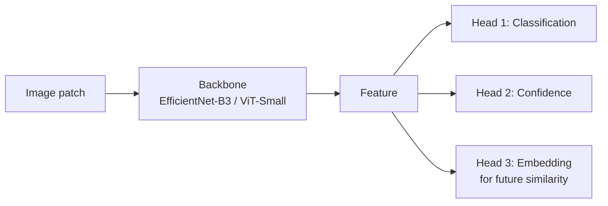
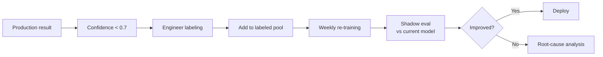
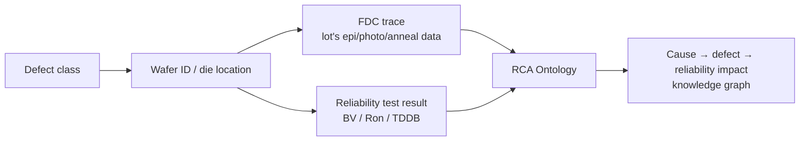

# Defect Classification Model

Design notes for a model that classifies SiC wafer / die-level defects.

## 1. Problem-Definition Matrix

| Granularity | Input | Classes | Candidate models |
|-------------|-------|---------|------------------|
| Wafer map | W × H bin map | 5~10 (radial / ring / edge / scratch / ...) | CNN, ViT |
| Die patch | 256 × 256 image | 10~30 | EfficientNet, Swin |
| Pixel mask | Full image | per-pixel multi-class | U-Net++, SegFormer |
| Time-series | Trace | 2 (normal / fault) | LSTM, Transformer |

## 2. Recommended Model Flow



**Why multi-head**:

1. **Classification head** — standard label prediction.
2. **Confidence head** — uncertainty estimation, route to human review.
3. **Embedding head** — similarity search when new defects are found.

## 3. Training Strategy

### 3.1 Data-scarce environment

SiC newer processes lack labeled data → combine the following:

- **Self-supervised pre-training** — SimCLR, DINOv2 to exploit unlabeled wafer images.
- **Few-shot fine-tune** — fine-tune with 100~1,000 labels.
- **Class balancing** — focal loss + weighted sampling.

### 3.2 Continual Learning

Re-train whenever a new defect is found:



### 3.3 Out-of-distribution Detection

Robust handling when unseen defects arrive:

- **Mahalanobis distance** on the feature space
- **Energy-based OOD** — free-energy computation
- On low confidence, route to an **"Unknown" class** → force engineer review

## 4. Evaluation (production-grade)

| Metric | Definition | Target |
|--------|-----------|--------|
| Macro F1 | Mean F1 across classes | > 0.85 |
| Worst-class recall | Weakest class | > 0.7 |
| FAR @ 95 % recall | False Alarm Rate | < 5 % |
| OOD AUROC | OOD vs ID | > 0.9 |
| Engineer agreement | Match with humans | > 0.9 |

## 5. Model Card (write at deployment)

Attach the following document to every deployed model:

```
- Model name / version / training date
- Training data: source / size / labeling method
- Eval data: holdout specification (separated from train)
- Performance: per-class metric + worst case
- Constraints: wafer / process conditions not validated
- Known failure cases: which defects are misclassified
- Owner / contact
```

## 6. RCA Ontology Linkage

Connect the classifier output to **process trace + reliability results**:



→ The author's PCB Root-Cause-Analysis ontology design experience (current INTERX work) extends naturally to SiC.

## 7. References

- Tan & Le, *EfficientNet*, ICML 2019
- Liu et al., *Swin Transformer*, ICCV 2021
- Hendrycks & Gimpel, *Baseline for Detecting Misclassified and OOD Examples*, ICLR 2017
- Author's case: WCMP MV classification model operation (DB HiTek)
