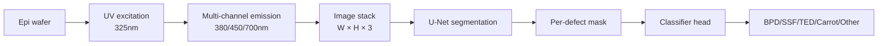
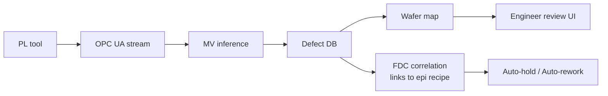

# Machine Vision Application Cases

Where Machine Vision creates value in a SiC fab, and the implementation patterns.
Extends the author's Si WCMP MV experience (Best Practice award) into the SiC domain.

## 1. Application Areas

| Area | Input image | Detection target | Candidate models |
|------|-------------|------------------|------------------|
| Epi defect detection | PL image (UV) | BPD / SSF / TED / Carrot | U-Net, Mask R-CNN |
| Wafer-surface inspection | Bright / Dark field | Particle, scratch | YOLO, CNN |
| Pattern inspection | SEM | CD outlier, bridging | Anomaly detection |
| Backside scan | Optical | Particle contamination | Classical CV + CNN |
| Die-level test | Microscope | Crack, chipping | EfficientNet |

## 2. PL-imaging-based Epi-defect Detection (Most Promising)

### 2.1 Data Flow

### 2.2 U-Net Training Tips

- Loss — **Dice + Focal** combo, weighted to small defects (TED pit).
- Augmentation — rotation and flip only (preserve intensity, since PL intensity carries meaning).
- Class imbalance — heavy oversampling for Carrot / Triangular.

### 2.3 Inference Time

- 1 wafer (8 inch) — ~50~100 patches (5 × 5 mm).
- On GPU (T4) — 1 wafer in < 5 s → suitable for production.

## 3. System Integration

- Joining MV results with the **FDC trace** lets you trace which recipe variable caused a carrot defect.
- Integration with the RCA Ontology auto-extracts rules like "epi MFC C/Si > 1.2 + susceptor T > X → triangular defect ↑".

## 4. Author's Si → SiC Case Notes

!!! note "WCMP machine-vision application experience"
    Author classified **dishing / erosion / scratch** patterns occurring on Si Tungsten-CMP wafers using **optical inspection + CNN**, enabling automatic disposition (DB HiTek Best Practice).

    **Success factors**:

    1. **Field definitions first** — codify defect definitions through a one-week workshop with engineers; agree on labels before modeling.
    2. **Start simple** — build a baseline by combining ResNet18 + classical CV features, then improve.
    3. **Dataset-operating system** — whenever a new defect is found, add labels immediately + weekly re-training pipeline.
    4. **Surface inference confidence** — confidence < 0.7 → route to engineer review.

    The same operational pattern transfers to SiC PL imaging.

## 5. Open Source / Tools

- **MMSegmentation** (PyTorch) — collection of SOTA segmentation models (U-Net, DeepLab, ...).
- **Detectron2** — Mask R-CNN.
- **MONAI** — originated in medical imaging but useful for PL multi-channel processing.
- **Label Studio** — defect-labeling UI.

## 6. Evaluation Metrics

| Metric | Definition | Target |
|--------|-----------|--------|
| IoU | Intersection over Union | > 0.7 |
| Per-class recall | Class-wise detection rate | Carrot > 0.95 |
| Per-class precision | Control false alarms | TED < 5 % FP rate |
| Wafer-level agreement | Match with engineer decision | > 0.9 |

## 7. References

- He et al., *Mask R-CNN*, ICCV 2017
- Ronneberger et al., *U-Net*, MICCAI 2015
- Author's case: WCMP MV (in-house material)
- T. Kimoto, *SiC defect characterization handbook*
