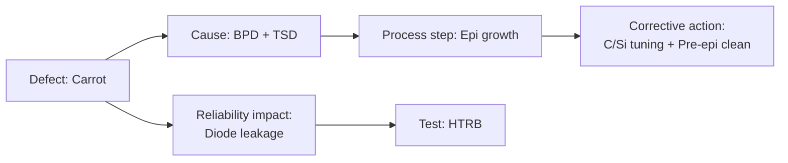

# RCA Ontology (PCB → SiC extension)

> A methodology for extending PCB Root-Cause-Analysis ontology design into the SiC defect domain.

## 1. Core Idea

- An **RCA Ontology** models the relationships between **defect → cause → corrective action → reliability impact** as a knowledge graph.
- The author's PCB-domain ontology work (current INTERX duties) extends with little change to a SiC fab, since defect-management workflows are similar.

## 2. PCB vs SiC

| Item | PCB | SiC |
|------|-----|-----|
| Defect granularity | Trace / via / SMT joint | Substrate / epi / die / package |
| Data sources | AOI · X-ray · electrical test | AOI · ADC · PL · electrical test |
| Cause taxonomy | Etch · plating · pad / SMT process | Substrate / epi / FEOL / BEOL / packaging |
| Reliability test | Mainly thermal cycle | TC + HTRB + HTGB + BTI + Body Diode |

## 3. Industry View

- Vertical-integration suppliers ([Ch.6 Vertical Supply Chain](../02-process/ch06-vertical-integration.md)) gather data across **boule → field**, so the ontology is **maximally effective**.
- Cross-vendor ontology standardization is in early stages, but [JC-70.2 (Part III §D-11)](../03-defect/d11-reliability.md) supplies vocabulary that can be reused.

## 4. Defect / RCA Links

- Acts as the **glue layer** between [B-6 ADC](../03-defect/b06-adc.md) output and [A-4 Killer RCA](../03-defect/a04-killer-rca.md).
- Connects [B-7 Klarity](../03-defect/b07-klarity.md) DSA results into the ontology so that "where the defect occurred" automatically links to "which process step is responsible."

## 5. Example Structure (sketch)

## 6. References

- Author's INTERX PCB RCA Ontology internal material
- "A Survey of Ontology-based Fault Diagnosis" — semiconductor / manufacturing literature
- JC-70.2 standard vocabulary for SiC reliability data

---

## Notes (2026-05-24)

- 1st draft of the page. Detailed schema will be expanded once the PCB → SiC mapping table reaches v1.
