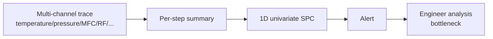
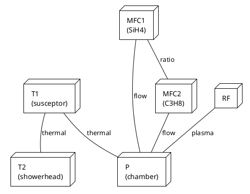
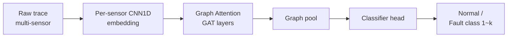
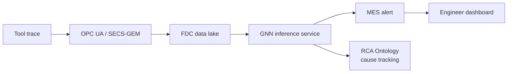

# FDC AI Anomaly Detection — Case Study

A case write-up of the **Graph Deep Neural Network–based FDC anomaly detection** that the author led at DB HiTek's Fab Innovation Team.
Related paper: *"Graph Deep Neural Network-based Fault Detection and Classification in Semiconductor Manufacturing"* (KCS 2023).

## 1. Background / Problem Statement

Existing FDC:

- Univariate SPC base → cannot exploit the richness of the trace.
- Only summary features per recipe step (mean / min / max).
- No cross-correlation between chambers.

## 2. The GNN Approach

Model the tool as a **graph**:

- **Node** — chamber sensors (temperature, pressure, MFC, RF, ...)
- **Edge** — physical / process correlations between sensors
- **Node feature** — time-series trace embedding (CNN / LSTM)
- **Graph feature** — full-chamber signature

## 3. Model Architecture

Key points:

- **Per-sensor embedding** — encode each trace into a fixed-length vector.
- **Graph Attention** — learn per-sensor importance.
- **Multi-task** — anomaly detection + cause-class classification jointly.

## 4. Training Data

| Data | Source | Volume |
|------|--------|--------|
| Normal | In-house FDC log (1 year) | ~50,000 runs |
| Known fault | RCA-case-labeled | ~3,000 runs |
| Synthetic fault | Physics-based injection | ~5,000 runs |

Labeling automated by joining with PM (Preventive Maintenance) logs.

## 5. Results (DB HiTek case)

| Metric | Univariate SPC | GNN FDC |
|--------|----------------|---------|
| Detection latency | run+1 | real-time |
| Recall (known fault) | 0.68 | 0.93 |
| Precision | 0.55 | 0.86 |
| Engineer-analysis time | 30~60 min/case | ~5 min |

## 6. SiC-process Considerations

!!! note "Field note"
    SiC's newer processes (epi, 1700 ℃ anneal, NO anneal) suffer from **a shortage of normal data itself**.
    To transfer Si-fab GNN-FDC patterns directly the following is required.

    1. **Domain adaptation** — pre-train on Si fab → fine-tune on SiC fab.
    2. **One-class / contrastive learning** — train using only normal data.
    3. **Physics-informed** — fold epi mass-balance / energy-balance constraints into the loss.

## 7. System Integration Flow

- Once connected to the RCA Ontology, the system can auto-estimate "which sensor caused which defect."
- The author's PCB Root-Cause-Analysis ontology design experience (current INTERX work) transfers to a SiC fab.

## 8. References

- Author's paper: *Graph Deep Neural Network-based Fault Detection and Classification in Semiconductor Manufacturing*, KCS 2023
- Velickovic et al., *Graph Attention Networks*, ICLR 2018
- Aibiz FDC-AI collaboration case (in-house)
- SECS / GEM standards (SEMI)
