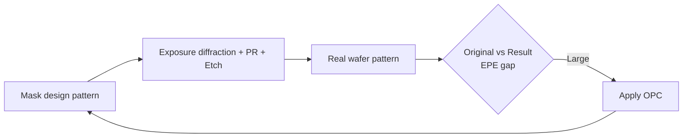
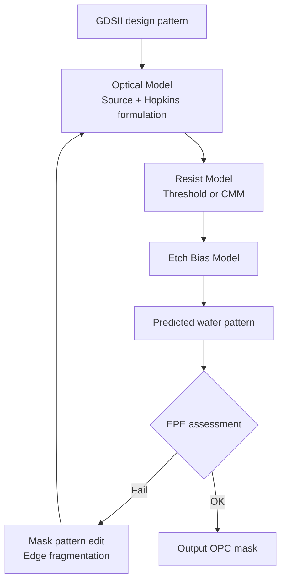

# OPC Mask Design

OPC (Optical Proximity Correction) intentionally distorts the mask pattern to compensate for **exposure diffraction** and **process variation**.

## 1. Why OPC Is Needed

In the resolution regime $k_1 \approx 0.4$:

- **Line-end shortening** — straight ends shrink
- **Corner rounding** — rectangular corners round off
- **Iso-dense bias** — isolated patterns and dense patterns produce different CD

→ Add **hammer-head, serif, assist features, Sub-resolution Assist Features (SRAF)** to the mask.

## 2. OPC Categories

| Type | Description | Use case |
|------|-------------|----------|
| **Rule-based OPC** | Correction by predefined rules | Simple layers, fast turn-around |
| **Model-based OPC** | Optical + Process model simulation, then correct | Critical layers, high precision |
| **Inverse Lithography (ILT)** | Solve backward from the desired result → free-form mask | Most accurate, expensive |

## 3. OPC Simulation Flow

Key models:

- **Optical model** — Source shape, NA, σ → kernel decomposition
- **Resist model** — CMM (Compact Modeling), VTRE (Variable Threshold)
- **Etch model** — dense / iso bias correction

## 4. EPE (Edge Placement Error)

$$EPE = (CD_{target} - CD_{simulated}) / 2 \pm \text{edge shift}$$

Evaluation: tens to hundreds of contour evaluation points.

Target: **EPE 3σ < CD × 10 %**.

## 5. Applying OPC to SiC

!!! note "Field note"
    Author has hands-on experience designing OPC masks and running photo-mask optimization simulations across Si Logic / LDI / BCD.
    Since SiC also uses KrF scanners, OPC is immediately applicable.

    **SiC-specific points to watch**:

    1. **Hard mask + PR stack** exposure → effective threshold differs from single-PR. Re-calibrate the resist model.
    2. **Wafer warpage** → wider focus excursion. The **Focus-Exposure Matrix (FEM)** spreads wider → reflect focus tolerance in the OPC model.
    3. **Trench MOSFET trench top corner** → apply hammer-head curvature correction to stabilize corner CD.

## 6. Verification → Production Flow

## 7. Related Patents (author)

- **Method for Recipe Generation of CD-SEM Equipment** (filed 10-2009-0134508 / published 10-2011-0077841)
- **Method for Preventing Wafer Edge Defocus of Exposure Equipment** (registered 10-0917821, 2009-09)

## 8. References

- A. Wong, *Resolution Enhancement Techniques in Optical Lithography*, SPIE
- Synopsys Proteus / Mentor Calibre Application Notes
- SPIE Photomask Technology Proceedings
