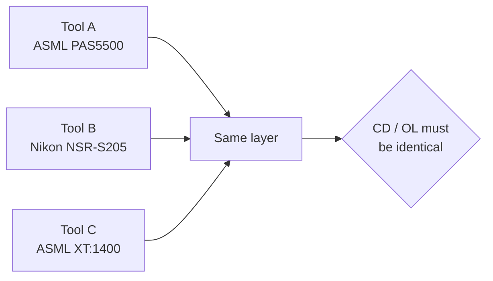
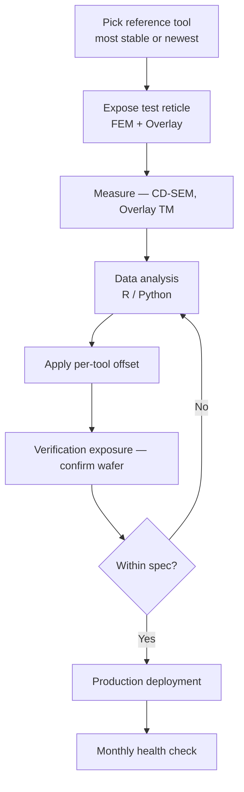

# ASML / Nikon Tool Matching

The work of statistically aligning **CD / Overlay / Focus / Dose** when running the same layer across multiple scanners.

## 1. Why Tool Matching Is Needed



Large tool-to-tool gaps cause:

- Lot-flow restrictions (layers become tool-specific)
- Wider yield distribution
- Complex WIP management

→ Goal: free lot flow within a **matched group** with identical SPEC.

## 2. Matching Items

### 2.1 Dose Matching

Correct the **dose offset** required at each tool to hit the same target CD.

```python
# Pseudocode — derive dose offset from measurement
import numpy as np

target_cd = 350  # nm
for tool in tools:
    dose_series = [...]      # 25 mJ/cm² ~ 35 mJ/cm² sweep
    cd_series   = [...]      # measured CD
    slope, intercept = np.polyfit(dose_series, cd_series, 1)
    dose_for_target = (target_cd - intercept) / slope
    tool.dose_offset = dose_for_target - reference_tool.dose
```

### 2.2 Focus Matching

Best focus differs per tool. Derived from the **FEM (Focus-Exposure Matrix)**:

- X axis: dose (5~7 points)
- Y axis: focus (−0.3 ~ +0.3 μm, 7 points)
- Bossung curve → best focus / focus latitude extraction

### 2.3 Overlay Matching

Correct each tool's **distortion fingerprint** (intra-field + inter-field):

$$\text{Overlay} = T + R + M + \text{higher order}$$

- T (translation), R (rotation), M (magnification): primary grid corrections
- 3rd / 5th-order distortion: apply **CPE (Correctable Per Exposure)**

### 2.4 CD Uniformity Matching

Correct each tool's **slit signature** (X-direction illumination uniformity).
Use ASML CDU correction (DoseMapper) / Nikon Dose Map.

## 3. Matching Workflow (field-applied method)



## 4. SPC Monitoring

After matching, monitor **drift** on a cadence:

| Metric | Frequency | Limit (example) |
|--------|-----------|-----------------|
| Dose accuracy | Daily | ±0.3 % |
| Focus accuracy | Weekly | ±15 nm |
| Overlay (matched) | Daily | < 8 nm (mean) |
| CDU (slit) | Weekly | 3σ < 4 nm |

Anomaly → FDC alert → engineer analysis.

## 5. SiC-specific Considerations

!!! note "Field note"
    From experience as a Si Photo Tool Matching Manager, TSMC and TI matching methodologies were used as benchmarks. Applying the same to SiC adds the following variables.

    1. **Wafer warpage** (bow ±50 μm)
        - Confirm the leveling system's capture range.
        - Leveling-sensor differences between tools have a larger effect on overlay.

    2. **Backside cleanness**
        - SiC particles can adhere to the chuck → wafer tilts.
        - Chuck-cleaning intervals must be aligned across tools.

    3. **Post-implant wafer stress**
        - Stress distribution after high-dose Al implant.
        - Tools respond to distortion slightly differently.

    → It is important to fold **pre-treatment (chuck clean, warpage screen)** into matching variables.

## 6. Statistical Tools

- **R** + ggplot2 + lme4 (mixed-effect model)
- **Python** + pandas + statsmodels + JMP-style analysis
- In-house automation: SPC WECO rules (details → [WECO Rule Design](fdc-weco-rules.md))

## 7. References

- ASML / Nikon Application Notes (internal)
- SPIE Advanced Lithography — Tool Matching sessions
- Author internal talk: "BEOL MTL Layer Alignment & Overlay Stabilization" (DB HiTek in-house paper award, 2006-11)
