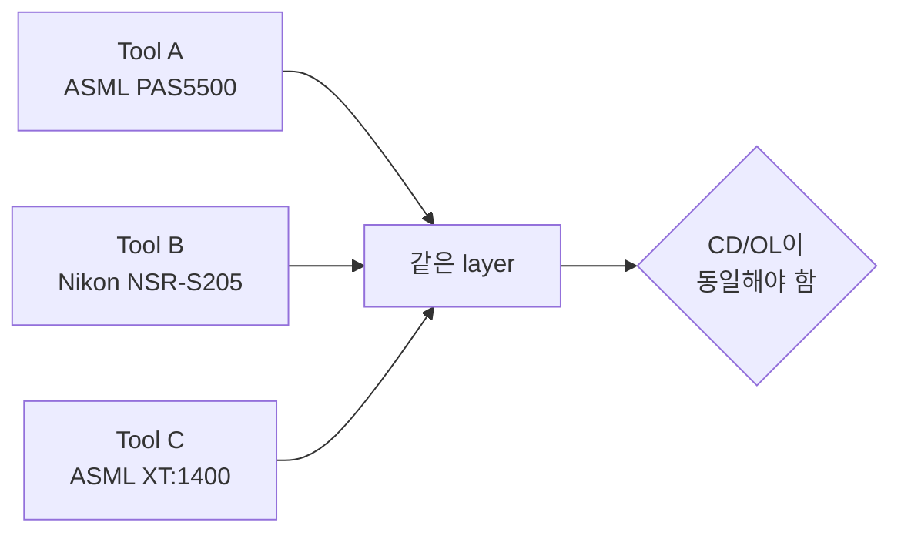
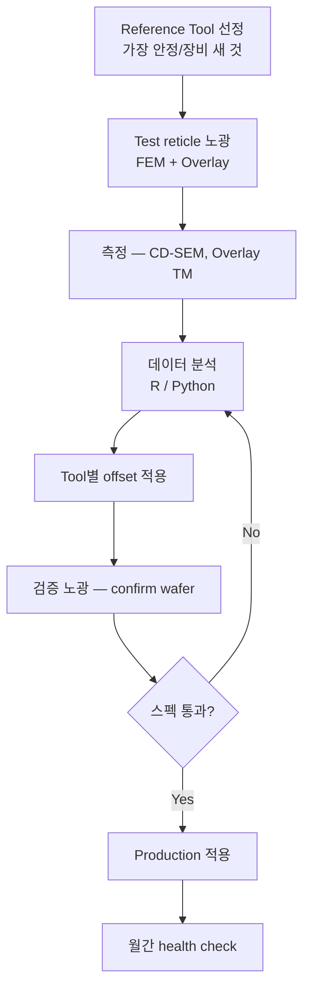

# ASML / Nikon Tool Matching

여러 노광기(scanner)에 동일 layer를 흘릴 때, **CD / Overlay / Focus / Dose**를 통계적으로 일치시키는 작업.

## 1. 왜 Tool Matching이 필요한가



Tool 간 격차가 크면:
- Lot 흐름 제약 (특정 tool 전용 layer 발생)
- Yield 산포 증가
- WIP 관리 복잡

→ 목표: **Matched group** 안에서 lot 자유 흐름 + 동일 SPEC

## 2. 매칭 항목

### 2.1 Dose Matching

각 tool에서 동일 target CD를 얻기 위한 **dose offset** 보정.

```python
# 의사 코드 — 실측 기반 dose offset 도출
import numpy as np

target_cd = 350  # nm
for tool in tools:
    dose_series = [...]      # 25 mJ/cm² ~ 35 mJ/cm² sweep
    cd_series   = [...]      # 측정 CD
    slope, intercept = np.polyfit(dose_series, cd_series, 1)
    dose_for_target = (target_cd - intercept) / slope
    tool.dose_offset = dose_for_target - reference_tool.dose
```

### 2.2 Focus Matching

Best focus는 tool마다 다름. **FEM (Focus-Exposure Matrix)** 으로 도출:
- X축: dose (5~7 points)
- Y축: focus (-0.3 ~ +0.3 μm, 7 points)
- Bossung curve → best focus / focus latitude 추출

### 2.3 Overlay Matching

각 tool의 **distortion fingerprint** (intra-field + inter-field) 보정:

\[
\text{Overlay} = T + R + M + \text{higher order}
\]

- T (translation), R (rotation), M (magnification): 1차 grid 보정
- 3차/5차 distortion: **CPE (Correctable Per Exposure)** 적용

### 2.4 CD Uniformity Matching

각 tool의 **slit signature** (X 방향 illumination 균일도) 보정.
ASML CDU correction (DoseMapper) / Nikon Dose Map 사용.

## 3. 매칭 워크플로 (현장 적용 방법)



## 4. SPC 관리

매칭 후에는 정기적으로 **drift**를 감시:

| Metric | Frequency | Limit (예시) |
|--------|-----------|--------------|
| Dose accuracy | Daily | ±0.3% |
| Focus accuracy | Weekly | ±15 nm |
| Overlay (matched) | Daily | < 8 nm (mean) |
| CDU (slit) | Weekly | 3σ < 4 nm |

이상 발생 → FDC alert → engineer 분석.

## 5. SiC에서의 추가 고려사항

!!! experience "현장 노트"
    Si Photo Tool Matching Manager 경험상 TSMC, TI의 매칭 방법론을 벤치마킹했습니다.
    SiC에 적용 시 다음 변수가 추가됩니다.

    1. **Wafer warpage** (Bow ±50 μm)
        - Leveling system이 capture 가능한 범위 확인
        - Tool 간 leveling sensor 차이가 overlay에 더 큰 영향

    2. **Backside cleanness**
        - SiC 입자가 chuck에 부착 → wafer가 기울어짐
        - Tool 간 chuck cleaning 주기 일치 필수

    3. **Implant 후 wafer stress**
        - High dose Al implant 후 wafer stress 분포
        - Tool마다 distortion 응답이 미세하게 다름

    → **Pre-treatment (chuck clean, warpage screen)** 을 매칭 변수에 포함시키는 것이 중요.

## 6. 통계 도구

- **R** + ggplot2 + lme4 (mixed-effect model)
- **Python** + pandas + statsmodels + JMP-style 분석
- 사내 자동화: SPC Weco rule (자세한 내용 → [Weco Rule 설계](fdc-weco-rules.md))

## 7. 참고 자료

- ASML / Nikon Application Notes (Internal)
- SPIE Advanced Lithography — Tool Matching Sessions
- 저자 사내 발표: "BEOL MTL Layer Alignment & Overlay Stabilization" (DB HiTek 사내 논문상, 2006.11)
